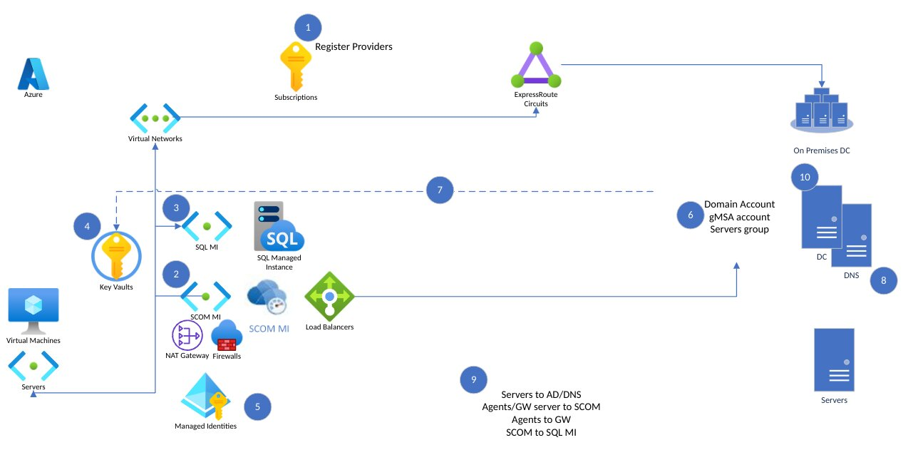

# Setup

#### [Previous](intro.md) | [Home](readme.md) | [Next](newfeatures.md)

## Pre-requisites

### Setup Process

[Step 1. Register the SCOM Managed Instance resource provider](https://learn.microsoft.com/en-us/system-center/scom/register-scom-managed-instance-resource-provider?view=sc-om-2022)

[Step 2. Create separate subnet in a VNet](https://learn.microsoft.com/en-us/system-center/scom/create-separate-subnet-in-vnet?view=sc-om-2022)

[Step 3. Create a SQL MI](https://learn.microsoft.com/en-us/system-center/scom/create-sql-managed-instance?view=sc-om-2022)

[Step 4. Create a Key vault](https://learn.microsoft.com/en-us/system-center/scom/create-key-vault?view=sc-om-2022)

[Step 5. Create a user assigned identity](https://learn.microsoft.com/en-us/system-center/scom/create-user-assigned-identity?view=sc-om-2022)

[Step 6. Create a computer group and gMSA account](https://learn.microsoft.com/en-us/system-center/scom/create-gmsa-account?view=sc-om-2022)

[Step 7. Store domain credentials in Key vault](https://learn.microsoft.com/en-us/system-center/scom/store-domain-credentials-in-key-vault?view=sc-om-2022)

[Step 8. Create a static IP](https://learn.microsoft.com/en-us/system-center/scom/create-static-ip?view=sc-om-2022)

[Step 9. Configure the network firewall](https://learn.microsoft.com/en-us/system-center/scom/configure-network-firewall?view=sc-om-2022)

[Step 10. Verify Azure and internal GPO policies](https://learn.microsoft.com/en-us/system-center/scom/verify-azure-and-internal-gpo-policies?view=sc-om-2022)

[Step 11. SCOM Managed Instance self-verification of steps](https://learn.microsoft.com/en-us/system-center/scom/scom-managed-instance-self-verification-of-steps?view=sc-om-2022)

Step 12. Create a SCOM Managed Instance!

- The virtual network must have a DNS server configured. This DNS server must be able to resolve the SCOM MI domain name.

#### [Previous](intro.md) | [Home](readme.md) | [Next](agents.md)

[Setup Docs](https://learn.microsoft.com/en-us/system-center/scom/tutorial-create-scom-managed-instance?view=sc-om-2022)