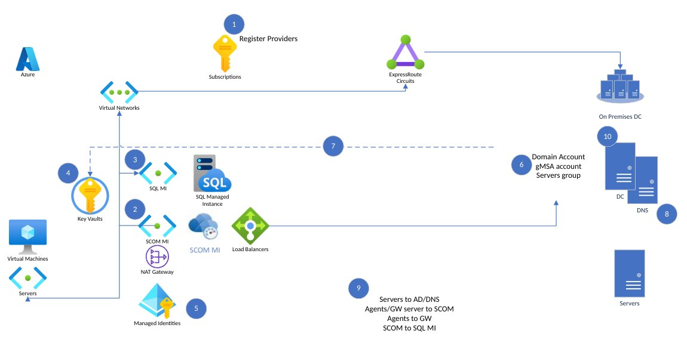

# Setup

#### [Previous](intro.md) | [Home](readme.md) | [Next](newfeatures.md)

## Pre-requisites

### Network requirements

Step 1. Register the SCOM Managed Instance resource provider

Step 2. Create separate subnet in a VNet

Step 3. Create a SQL MI

Step 4. Create a Key vault

Step 5. Create a user assigned identity

Step 6. Create a computer group and gMSA account

Step 7. Store domain credentials in Key vault

Step 8. Create a static IP

Step 9. Configure the network firewall

Step 10. Verify Azure and internal GPO policies

Step 11. SCOM Managed Instance self-verification of steps

Step 12. Create a SCOM Managed Instance

- SCOM MI requires a virtual network in Azure. This virtual network must have a gateway subnet and a virtual network gateway. The gateway subnet must be at least /29 and the virtual network gateway must be a VPN gateway.
- The virtual network must have a DNS server configured. This DNS server must be able to resolve the SCOM MI domain name.

[Setup Docs](https://learn.microsoft.com/en-us/system-center/scom/tutorial-create-scom-managed-instance?view=sc-om-2022)

#### [Previous](intro.md) | [Home](readme.md) | [Next](agents.md)
