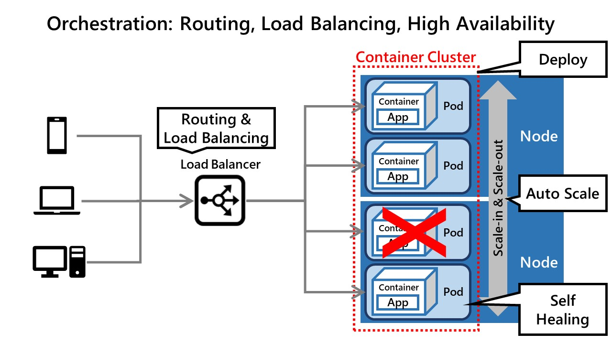

***  

***  

***  

***  

***  

***  

***  

***  

***  

***  

***  

***  

***  

***  

***  

***  

***  

***  

***  

***  

***  

***  

***  

***  

***  

***  

***  

***  

***  

***  

***  

***  

***  
- [Home](./README.md)
- [Back](./0_Intro.md)
- [Next](./2_Concept.md)