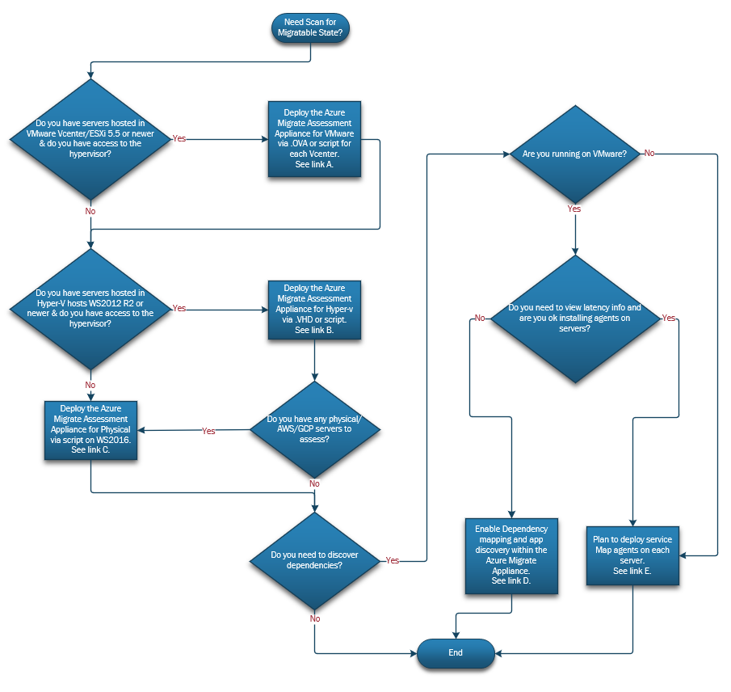

# Milestone: Scan

#### [prev](./overview.md) | [home](./welcome.md)  | [next](./assess.md)

The following content can be used as a checklist to incorporate within your migration project plan to ensure best practices.

**CAF Reference:** [Plan - Gather Inventory Data ](https://docs.microsoft.com/en-us/azure/cloud-adoption-framework/digital-estate/inventory)

## **1 Scan Tool Planning and Implementation** 

### &nbsp;&nbsp;&nbsp;&nbsp;1.1\.  Plan for scanning agents/appliances that will be needed to discover the state. 
 

- &nbsp;&nbsp;&nbsp;&nbsp;Reference Link A: https://docs.microsoft.com/en-us/azure/migrate/tutorial-discover-vmware#set-up-the-appliance
- &nbsp;&nbsp;&nbsp;&nbsp;Reference Link B: https://docs.microsoft.com/en-us/azure/migrate/tutorial-discover-hyper-v#set-up-the-appliance
- &nbsp;&nbsp;&nbsp;&nbsp;Reference Link C: 
    - &nbsp;&nbsp;&nbsp;&nbsp;Physical/Other hypervisors: https://docs.microsoft.com/en-us/azure/migrate/tutorial-discover-physical#set-up-the-appliance
    - &nbsp;&nbsp;&nbsp;&nbsp;AWS: https://docs.microsoft.com/en-us/azure/migrate/tutorial-discover-aws#set-up-the-appliance
    - &nbsp;&nbsp;&nbsp;&nbsp;GCP: https://docs.microsoft.com/en-us/azure/migrate/tutorial-discover-gcp#set-up-the-appliance
- &nbsp;&nbsp;&nbsp;&nbsp;Reference Link D: https://docs.microsoft.com/en-us/azure/migrate/how-to-create-group-machine-dependencies-agentless
- &nbsp;&nbsp;&nbsp;&nbsp;Reference Link E: https://docs.microsoft.com/en-us/azure/migrate/tutorial-discover-vmware#provide-server-credentials
- - &nbsp;&nbsp;&nbsp;&nbsp;Reference Link F: https://docs.microsoft.com/en-us/azure/migrate/how-to-create-group-machine-dependencies

### &nbsp;&nbsp;&nbsp;&nbsp;1.2\. Implement scanning agents/appliances.

### &nbsp;&nbsp;&nbsp;&nbsp;1.3\. Ensure scanning agents/appliances have been running for at least 7 days or more for accuracy of collected data.

## **2 Scan Document** 

### &nbsp;&nbsp;&nbsp;&nbsp;2.1\. Is the scan completed? If so, collect scan and upload to internal tracking systems.
