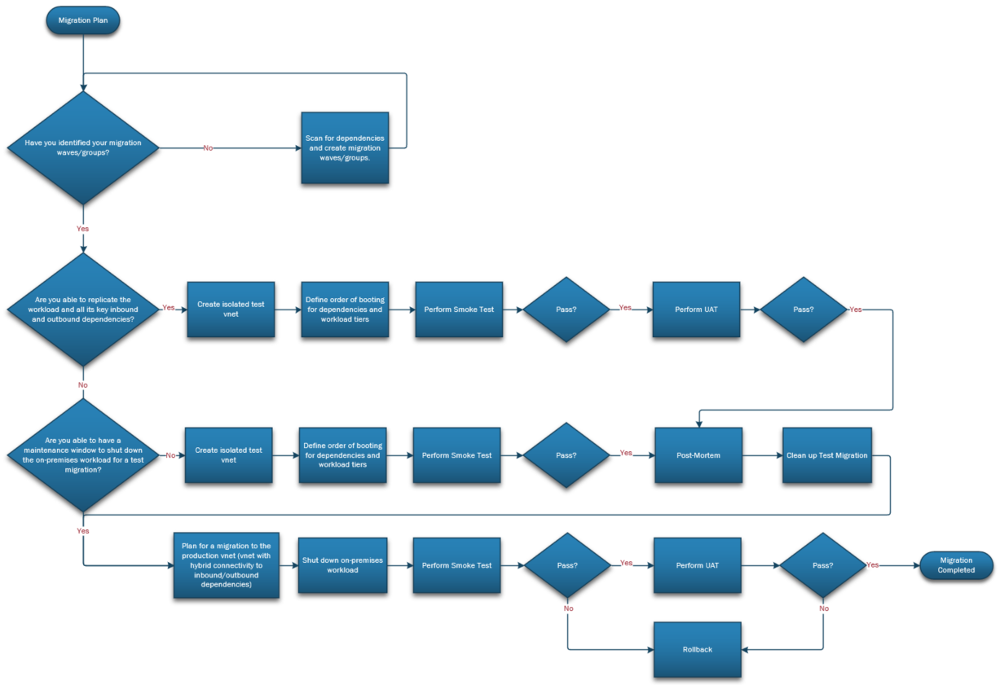

# Milestone: Testing Environment for Migration Wave

#### [prev](./devops-iac-redeployment.md) | [home](./readme.md)  | [next](./devops-iac-migration.md)

## Overview
This section outlines the steps needed in order to execute an Azure DevOps Pipeline with the appropriate tasks needed for setting up a test environment for migration. This implementation focuses on rehosting a subset of the defined migration wave in order to test the server functionality with the parameters from the Azure Migrate Assessment.

The sample pipeline takes the output of an Azure Migrate Assessment and creates an isolated test environment with new VMs that are based on the configuration from the exported assessment output. The VMs that will be created via this sample pipeline are empty Marketplace images, ready for configuration and app installation.

## 1 Pre-Requisites
To get started, the assumption is the following:
* The [discovery](https://github.com/Azure/FTALive-Sessions/blob/main/content/migration/server-migration/scan.md) is completed for the scoped VMs.
* The [assessment](https://github.com/Azure/FTALive-Sessions/blob/main/content/migration/server-migration/assess.md) for the environment is created within Azure Migrate.
    * The assessment is the source for where the VMs in the pipeline are created. Please ensure that only the VMs that are scoped for the test environment are in the assessment. Please manually omit VMs not needed in the deployment.
* The assessment was exported as an Excel file to your local machine.
* An [Azure DevOps Organization](https://docs.microsoft.com/en-us/azure/devops/organizations/accounts/organization-management?view=azure-devops) is created and linked to your subscription in Azure.
* The [src folder](./src/) is cloned on your local machine.
* [PowerShell](https://docs.microsoft.com/en-us/powershell/scripting/install/installing-powershell?view=powershell-7.2) and Excel are installed on your local machine.


### 1.1\. Pre-Migration Tasks 
Please refer to the [Pre-Migration and Post-Migration Activities](https://github.com/Azure/FTALive-Sessions/blob/main/content/migration/server-migration/testing.md#1-pre--post--migration-activities-defined) page that should be defined before executing the test pipeline. General best practices when preparing for test migration:

**Isolated VNet**
- Define parameters needed for an isolated VNet implementation (i.e. CIDR block, NSG Ports that will open on the test subnet, etc.).
- Test the connectivity in the isolated ([Guidance for identifying target VNet](https://github.com/Azure/FTALive-Sessions/blob/main/content/migration/server-migration/testing.md#23-identify-target-vnets-tests-and-migration-workflow)
- Ensure that appropriate stakeholders are given the least privilege permissions to execute the pipelines.
- Define Test Migration approach through waves of execution
    - Understand dependencies to create migration waves/groups.
    - Define test cases.
    - Ensure Rollback plan is in place for the re-hosted VMs.
    - Make sure that test data is consistent with the data used in production.
- Clean up test resources that were deployed in an isolated VNet.

**Production VNet**
- Define parameters needed for the production VNet
- Plan a maintenance window to shut down on-prem workload for test migration, set up a VNet with the parameters needed for production workloads to move to Azure
- Define test cases for the environment
- Choose non-prod VM Migration group to start the test functionality with.
- Perform tests on a smaller VM waves of the workloads first.
- Ensure Rollback plan is in place for the re-hosted VMs.


### 1.2\. Create the appropriate scripts that correlate to the [types of tests](https://github.com/Azure/FTALive-Sessions/blob/main/content/migration/server-migration/testing.md#2-migration-plan-definition) needed for your deployment:
- Smoke Test
- UAT
- Failover



## 2 Pipeline Execution for Testing

This sample testing pipeline can be customized to fit the needs of your organization and can be modified to incorporate specific tests needed for your app validation in the Testing phase of migration.

### 2.1 PowerShell Implementation

The steps below outline the process for redeploying Azure assets through PowerShell, using the csvs as a source for the IaaS parameters.

#### 2.1.1\. Input parameters your environment using the [testing-variables.yml](./src/test-migration/testing-variables.yml) as a template.

#### 2.1.2\. Create a `testing-pipeline.yml` for resource execution using the provided [template](./src/test-migration/testing-pipeline.yml) as a baseline. Below are a description of the tasks:
Pipeline Tasks:
- Start Test Migration
    - Create isolated VNet (optional)
    - Within Powershell script:
        - Create the Migration Group Compute needed
- Validate Test Environment (manually or using test scripts)
    - Run Testing Scripts (if applicable)
        - Smoke Test
        - UAT
        - Failover
- Clean up Test Resources

### 2.2 Bicep Implementation

The steps below outline the process for redeploying Azure assets through Bicep. This implementation uses the PowerShell script implementation (2.1) as a baseline for parsing the parameters and then executes the resources based on the parameters outlined by the CSVs in order to create Azure resources using Bicep.

#### 2.2.1\. Input variables for your environment in Azure DevOps under `Pipelines` > `Library`. There you will see a variable group called `bicepPipelineVariables` where you can input the appropriate parameters.
* More info on variable groups [here](https://docs.microsoft.com/en-us/azure/devops/pipelines/library/variable-groups?view=azure-devops&tabs=yaml).

#### 2.2.2\. Create a `testing-pipeline.yml` for resource execution using the provided [template](./src/bicep/azure-pipelines.yml) as a baseline. Below are a description of the tasks:
Pipeline Tasks:
- Create isolated VNet with Bicep deployment (optional)
- Powershell script run to parse the parameters and call Bicep templates for execution.
- Clean up Test Resources

### 2.3\. Validate Target VNet Tests
* If execute the isolated VNet Testing Pipeline, validate the pipeline has ran through the necessary tasks above.
* If utilizing the final Migration VNet, set the maintenance window and prepare migration waves for execution using the sample pipeline [template](./src/test-migration/testing-pipeline.yml) for migration.
* If any of the tests fail within a pipeline stage, execute the Rollback plan for the migration wave.

### 2.4\. Post Test Migration Tasks 
- Validate VM migration was successful and that applications are functioning as expected
    - Perform capacity testing to ensure that functioning properly in production

### 2.5\. Expected Results 
* VNet created with specified parameters for testing its functionality before full migration of servers to Azure
* Standardized pipeline to utilize for deploying compute resources in Azure
* Pipeline provides option for executing tests within Azure on the testing resources that are deployed
* Pipeline performs clean up of test resources after validation of functionality

### 2.6\. Considerations for Customizations
The provided templates in the Azure DevOps Repo are meant to be a starter baseline for the execution of your migration waves. The defaults for the variables are based on the input CSV from Azure Migrate. Below are some additional areas for consideration if want to further customizing the templates to fit your business needs for redeploying Azure resources.

#### 2.6.1\. Modifying VM SKU and Disk Size
In the bicep templates, these options can be modified in the [Windows Bicep Template](./src/bicep/vmWindows.bicep) and [Linux Bicep Template](./src/bicep/vmLinux.bicep) in the following sections: 
* **SKU parameter:** `param sku string` can be edited (i.e. `param sku string = '2019-Datacenter'`).
* **VM Size:** `param vmSize string` can be edited (i.e. `param vmSize string = 'Standard_D2s_v3'`).
* **Disk Size:** `param osDiskSize int` can be edited (i.e. `param osDiskSize int = 127`).
* **Data Disk Size:** data disks are currently looped through in the following method based on the input CSV: 
    ```bicep
     dataDisks: [for i in range(0,length(datadisksizes)): {
        name: '${vmname}-dataDisk${i}'
        diskSizeGB: datadisksizes[i]
        lun: i
        createOption: 'Empty'
        managedDisk: {
            storageAccountType: datadisktypes[i]
        }
     }
    ```
    The disks can also be added on an individual basis in the following method:
    ```bicep
    dataDisks: [
        {
            diskSizeGB: 1023
            lun: 0
            createOption: 'Empty'
        }
    ]
    ```

#### 2.6.2\. VM Diagnostics Settings
Boot Diagnostics can be enabled or disabled in the following section:

```bicep
 diagnosticsProfile: {
    bootDiagnostics: {
        enabled: true (#set as false to disable)
    }
 }
```
A specific storage account can also be referenced to correlate to the VMs by adding a storage account reference: 

```bicep
var storageAccountName = 'bootdiags${uniqueString(resourceGroup().id)}'

resource bootStorage 'Microsoft.Storage/storageAccounts@2021-04-01' = {
  name: storageAccountName
  location: location
  sku: {
    name: 'Standard_LRS'
  }
  kind: 'Storage'
}

```
and the following under `bootDiagnostics`:
```bicep
diagnosticsProfile: {
    bootDiagnostics: {
        enabled: true (#set as false to disable)
        storageUri: bootStorage.properties.primaryEndpoints.blob
    }
 }
```