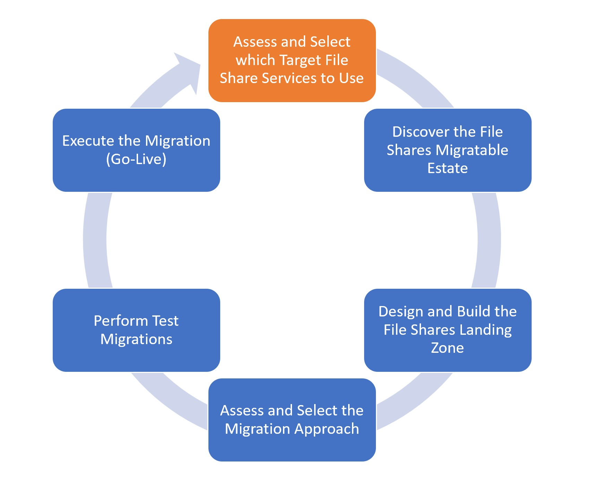

# Milestone: Assess and Select Target File Share Service
#### [prev](./overview.md) | [home](./readme.md)  | [next](./scan.md)

The following content can be used as a checklist to incorporate within your migration project plan to ensure best practices.

## Define and Gather File Services Requirements
The following table lists common file services requirements to be considered when planning to migrate file services to Azure. Knowing your requirements will help ensure you select the appropriate solution that meets your needs. 

| Category | File Migration Requirements| Details |
| --- | -------| ---------- |
|Access| Access methods for file data | What protocol(s) will clients use to access file data--SMB, NFS, HTTP/REST? Are there protocol version requirements, such as a newer version of a protocol to support a security feature? |
|Access| Client connectivity method | Are clients permitted to access file data over the internet when the protocol implements encryption, or is it required that file data access traverse a VPN or ExpressRoute connection? |
|Access| Data change locations| Will all changes to file data be made on a specific replica (such as on-prem) or at multiple locations (on-prem and in the cloud)?|
|Access| Authentication and authorization | How will clients be authenticated and authorized when they access file data post-migration? Will filesystem-level permissions be required or are share-level permissions sufficient?|
|Access| Legacy Operating System or Solution | Are there any legacy file server solutions on-prem? E.g. any file service running on WS2012 (non-R2), WS2008 R2 or older?
|Data| Access patterns for files| Is file data access generally sequential or is there significant random read and write operations, such as with database files or virtual disk files? |
|Data| File type compatibility| What is the general description of your file data in each share? For example: user documents, application data and configuration, database files, etc.|
|Performance| Data tiering | Would tiering files across different storage types result in significant cost savings or performance benefits? For example, if 90% of files are old and rarely accessed, would it make sense for them to be on lower performance storage? |
|Organization| Share structure and file hierarchy | How are your shares and the underlying file system organized? Do shares have specific performance requirements, classifications, environment levels, business purpose etc. or is file data in shares mixed?|
|Protection| Backup RPO, RTO, and retention requirements| How often will the file data need to be backed up? How quickly do you need to restore your data? How long will recovery points be retained and how many total recovery points will you require? Are there any offsite backup requirements?|
|Protection| Data resiliency (locally-redundant in Azure region, zone redundant within a region, geo-replicated across regions) | Will your file data require redundancy beyond a single datacenter or region?|
|Performance| Share performance (IOPS) | How busy is each of your shares in your source environment, measured in IOPS? |
|Performance| End-to-end latency and client proximity| Do your clients have specific latency requirements when accessing file data? Will this require your file data to be located in close proximity to your clients? If so, how are clients located geographically?|
|Optimize| Hardware constraints | Do you have any hardware (EoL) or storage (capacity/performance) constraints on-prem? Are you consolidating your file servers or shares on-prem? Will tiering data to cloud storage help optimize/reduce current hardware/storage challenges?|
|Cost| Cost | Do you have specific requirements around the cost of your file solution in Azure which might limit your options?|
|Migration| Cutover requirements for complete migrations (from the client perspective) | When it comes time to cut over to migrated files, will your clients have specific downtime requirements and schedules? How will clients be directed to new file services paths (if applicable)? |
|Migration| Migration timeline | How quickly does your migration need to be completed? |
|Migration| Anticipated future changes to file service requirements| Are there predicted to be changes to your file services requirements in the future which may impact your solution design? |

## **Choose a Target File Share Service** 
### Choose between IaaS vs. PaaS file shares

- Review this [table](https://docs.microsoft.com/en-us/azure/virtual-desktop/store-fslogix-profile#azure-platform-details) to help identify your initial file share cloud platform model. 
### Validate best fit scenario 

- Review this [table](https://docs.microsoft.com/en-us/azure/cloud-adoption-framework/ready/considerations/storage-options?toc=https%3A%2F%2Fdocs.microsoft.com%2Fen-us%2Fazure%2Farchitecture%2Ftoc.json&bc=https%3A%2F%2Fdocs.microsoft.com%2Fen-us%2Fazure%2Farchitecture%2Fbread%2Ftoc.json#file-and-object-storage-scenarios) to help identify your initial scenario and suggested Azure storage service.
### Initial review for protocol, performance and limits

- Review this [decision tree](https://docs.microsoft.com/en-us/azure/storage/common/storage-migration-overview?bc=/azure/cloud-adoption-framework/_bread/toc.json&toc=/azure/cloud-adoption-framework/toc.json#choose-a-target-storage-service) to help choose between Azure Files, Azure NetApps, and Blob Storage.
- If you want to capture performance requirements for application (e.g. file service) manually from the server, you can use [Performance Counters - how to capture perf counters?](https://learn.microsoft.com/en-us/azure/virtual-machines/premium-storage-performance#counters-to-measure-application-performance-requirements)

### Deeper review to help choose between Azure Files, Blobs and NetApp

Validate your selection via the below comparison articles to help make the final decision on a target file share service:
- [Table Comparison for Azure Blob Storage, Azure Files and Azure NetApp Files (for NFS)](https://docs.microsoft.com/en-us/azure/storage/common/nfs-comparison?toc=/azure/storage/files/toc.json)
- [Table Comparison for Azure Files and Azure NetApp Files](https://docs.microsoft.com/en-us/azure/storage/files/storage-files-netapp-comparison)
- Review [SMB features not supported in Azure Files](https://learn.microsoft.com/en-us/rest/api/storageservices/features-not-supported-by-the-azure-file-service)

### Other Scenarios or Use cases

If the data being migrated has application data, things like semi-structured data, databases, archives, or data needing special processing, review the flow chart below to make best target datastore choices:
- [Select an Azure data store for your application](https://learn.microsoft.com/en-us/azure/architecture/guide/technology-choices/data-store-decision-tree#select-a-candidate)

