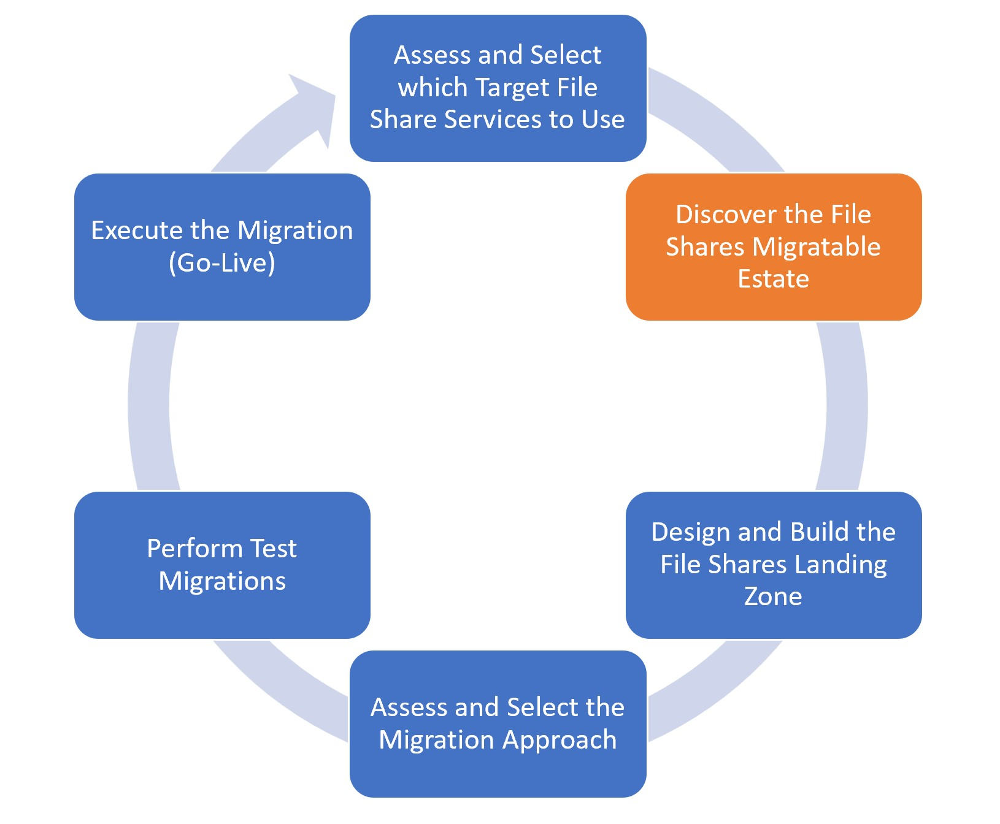

# Milestone: Scan File Shares

#### [prev](./assess.md) | [home](./readme.md)  | [next](./landingzone.md)

The following content can be used as a checklist to incorporate within your migration project plan to ensure best practices.

## **Discover Source File Shares** 

### Choose between automated vs. manual approach
In the [Discovery](https://docs.microsoft.com/en-us/azure/storage/common/storage-migration-overview?toc=/azure/storage/blobs/toc.json#discovery-phase) phase, you can take manual approach or use automated tools.
- Automated approach: encompass wizard driven tools which auto discover and inventory source file share environments.
- Manual approach: refers to building custom scripts or using native file service capabilities. 
 
### Review if automated discovery tool supports desired sources and destinations

- [Storage Migration Service](https://learn.microsoft.com/en-us/windows-server/storage/storage-migration-service/overview#requirements)
- [File Sync Service and Third Party ISVs](https://docs.microsoft.com/en-us/azure/storage/solution-integration/validated-partners/data-management/migration-tools-comparison?bc=/azure/cloud-adoption-framework/_bread/toc.json&toc=/azure/cloud-adoption-framework/toc.json#supported-azure-services)
- [NetApps Cloud Sync](https://docs.netapp.com/us-en/cloud-manager-sync/reference-supported-relationships.html)
### Review if automated discovery tool provides desired assessments and reporting
- [Azure Storage Mover (Public Preview)](https://learn.microsoft.com/en-us/azure/storage-mover/service-overview#supported-sources-and-targets)
- [File Sync Service and Third Party ISVs](https://docs.microsoft.com/en-us/azure/storage/solution-integration/validated-partners/data-management/migration-tools-comparison#assessment-and-reporting)
    - Consider the [File Migration Program](https://techcommunity.microsoft.com/t5/azure-storage-blog/migrate-the-critical-file-data-you-need-to-power-your/ba-p/3038751) to attain free licensing for selected ISVs
- [Storage Migration Service](https://docs.microsoft.com/en-us/windows-server/storage/storage-migration-service/migrate-data#step-1-create-a-job-and-inventory-your-servers-to-figure-out-what-to-migrate)
- [NetApps Cloud Sync](https://docs.netapp.com/us-en/cloud-manager-sync/task-managing-reports.html#creating-reports)

## **Discover File Shares Dependencies**

### Choose between automated vs. manual approach to discover clients
Azure Migrate or other third party tools can be used to discover dependent client machines based on TCP connections on standard ports such as 445, 139, 2049, etc. 
Other common dependencies may include other servers not necessarily consuming the files shares, but managing them. For example: A DFSN Server

Guidance can be found in our [FTA Live for Server Migration](../server-migration/assess.md) content. 
