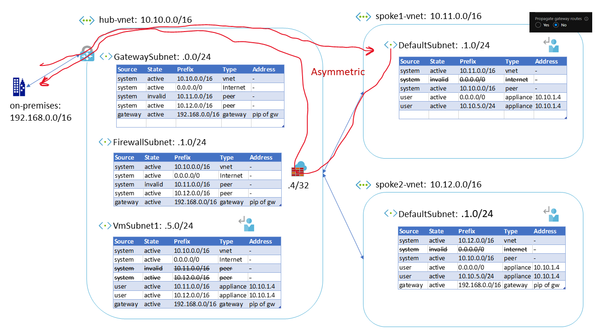

# Configure Route Tables for Hub and Spoke Topology

#### [prev](../readme.md) | [home](../readme.md)

These graphics walk through how to configure route tables for appropriate routing in a hub and spoke virtual network topology.

