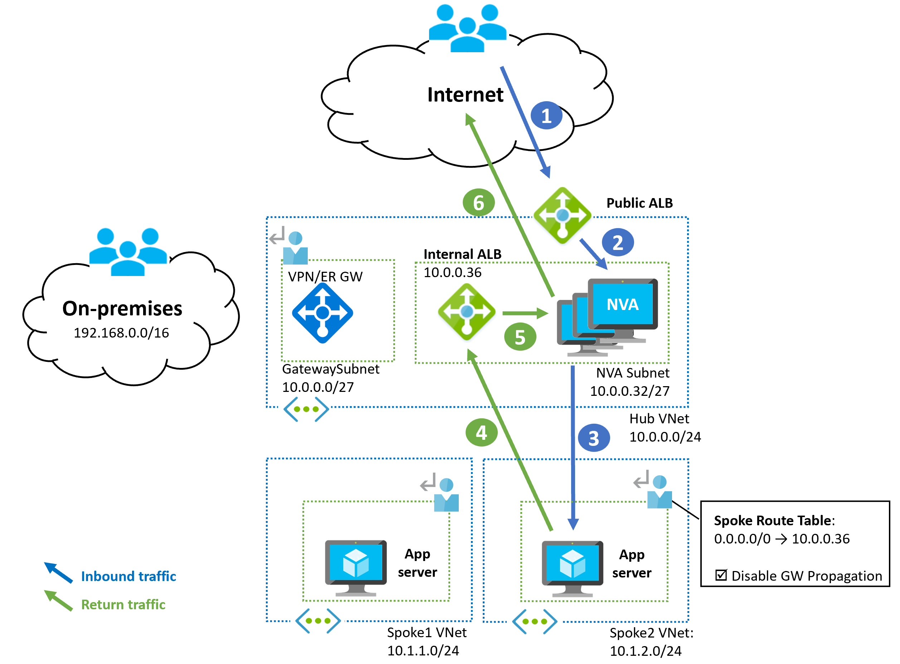

# VNet Basics

[prev](./why.md) | [home](./readme.md)  | [next](./topology-overview.md)

## What is an Azure Virtual Network (VNet)?

- A self contained software-defined network
- Exists in a single region

> NOTE:
> Configure IP address and DNS settings outside of the VMs OS. Leave the VM to use DHCP (yes, even for NVAs)

A VNet enables you to connect your resources to each other, the internet, and other networks you own. By default, VNets are isolated from each other and establish a connectivity and network security boundary. Everything connected to a VNet must reside in the same region as the VNet.

## VNet configuration

- Assign one or more address spaces
  - Address spaces can be added after creation
  - Address spaces with subnets cannot be modified
- Addresses will automatically be allocated to connected services

## DNS and VNets

DNS for VNet-connected resources can be configured at the VNet level or on the NIC (not at the VM OS!)

- Set to Azure provided by default, which includes DNS Zones and Private DNS Zones (if used)
- Can be set to one or more IPs for custom DNS servers
- [Guide for configuring hybrid DNS in Azure](https://docs.microsoft.com/azure/architecture/hybrid/hybrid-dns-infra)

## Connecting within a VNet

- Traffic within and *between* subnets allowed by default
- Use subnets to separate different applications, environments, or application tiers
- Employ NSGs to restrict traffic in and between subnets

## Connecting to a VNet

Connecting to endpoints within a VNet requires additional configuration or the deployment of a resource with an associated public endpoint.

- No inbound connectivity is possible except through public-facing endpoints like Public IPs, Application Gateways, and Load Balancers
- Assigning Public IPs to VMs is not recommended in production
  - Use Azure Bastion or hybrid connectivity for management access
  - Use App Gateway, Azure Firewall, or Standard Load Balancers for application traffic
- From your remote networks: use a Virtual Network Gateway or custom VPN solution, detailed in [Connectivity section](./connectivity.md)

## Connecting from a VNet

Outbound connectivity to the internet is enabled by default in Azure--VNet configurations and default NSG rules allow outbound traffic. Azure's management plane relies on traffic being able to egress the VNet for services such as VM agents, DNS, and monitoring.

- Default outbound NAT to a dynamic Azure Datacenter IP for internet access
- VMs with a Public IP will use the public IP address for outbound SNAT
- For persistent outbound IPs and production level SNAT port control, use NAT Gateway, a Standard Load Balancer, or a network appliance

> NOTE:
> More information for [**Outbound connection (flows)**](https://docs.microsoft.com/azure/virtual-network/ip-services/default-outbound-access)

## Connecting between VNets

- VNets are isolated by default
- VNet peering or VPN. Covered in [Connectivity section](./connectivity.md)

## [VNet Frequently Asked Questions](https://docs.microsoft.com/azure/virtual-network/virtual-networks-faq)

## Network Virtual Appliances (NVAs)

Network Virtual Appliances (NVAs) encompass a variety of networking solutions deployed on VMs in Azure. Common examples are firewall products, network monitoring products, and third-party VPN solutions. NVAs are generally used to provide additional functionality not included in Azure's first-party services or for management consistency with existing tools.

