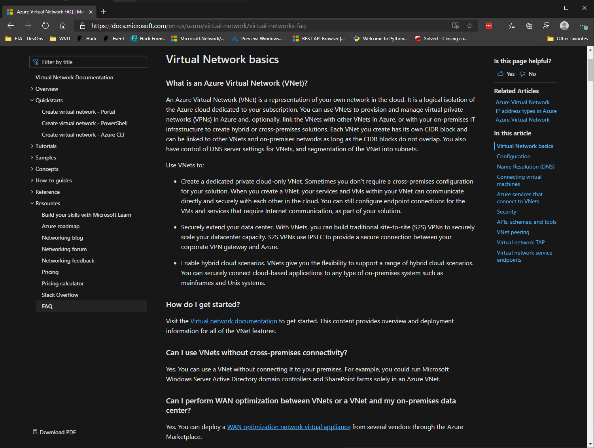

# VNet Basics

#### [prev](./concepts.md) | [home](./readme.md)  | [next](./topology-overview.md)

## How does a virtual machine connect to the network?

> Configure IP address and DNS settings outside of the VMs OS. Leave the VM to use DHCP (yes, even for NVAs).

Subnets and other VNets
- Connected by default.
- A basic NSG provides minimum ingress/egress controls.

Internet locations
- NAT is performed by the networking fabric by-default.
- A public IP is **NOT** needed for internet access.

On-premises network
- Via the internet.
- Via a Gateway.

More information for [Outbound connection (flows)](https://docs.microsoft.com/en-us/azure/load-balancer/load-balancer-outbound-connections)

## How do you connect to a virtual machine?

Azure Bastion (or even via console)
- RDP and SSH over HTTPS.
- Secure, simple, effective.
- [VNet peering and Azure Bastion](https://docs.microsoft.com/en-us/azure/bastion/vnet-peering).

Via an on-premises connection
- Connecting to the virtual machine's private IP address.

Via the internet
- Through an Application Gateway or Firewall.
- Assigning a public IP to the virtual machine directly.

## What are the basics?

[Virtual network basics](https://docs.microsoft.com/en-us/azure/virtual-network/virtual-networks-faq)

