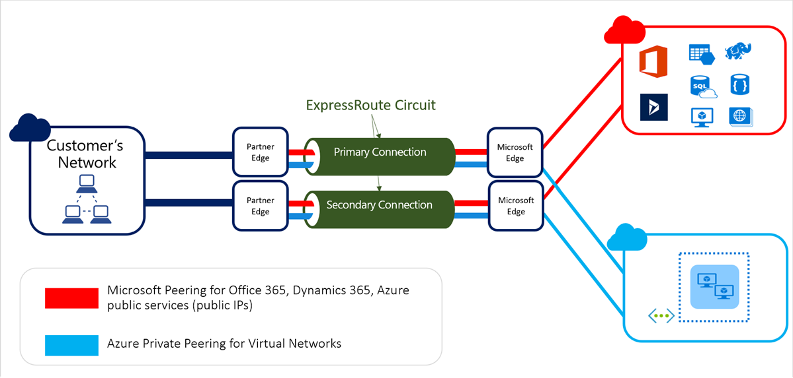
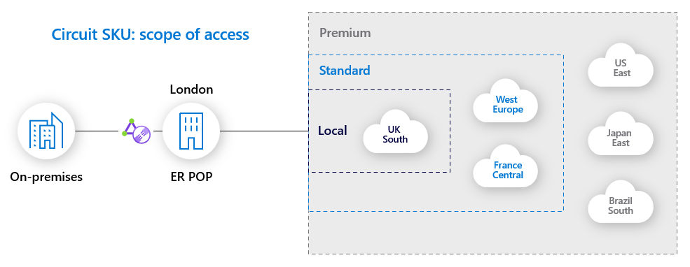
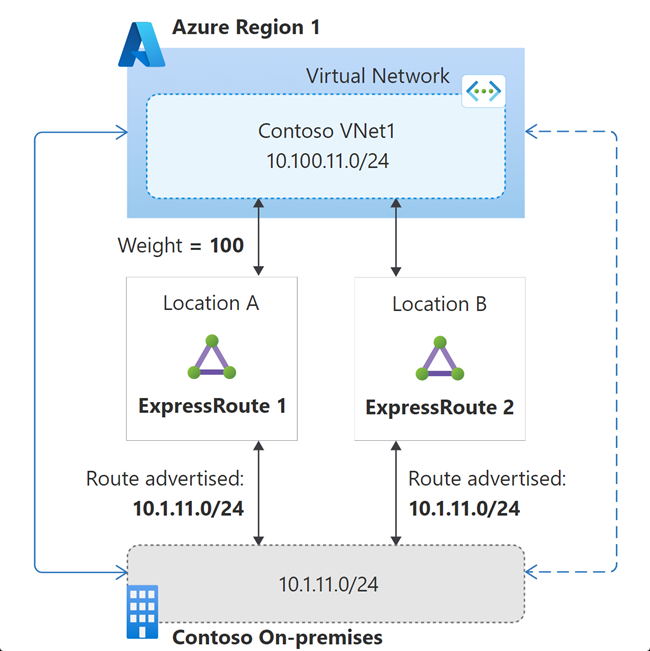

# Connectivity to External Networks

[prev](./readme.md) | [home](./readme.md)  | [next](./topology-advanced.md)

## Overview

If you need to communicate with services (using a private IP) in another network there are a few options depending on your requirements, primarily VPN or ExpressRoute. The Azure Architecture center has a a great article comparing the two [here](https://docs.microsoft.com/azure/architecture/reference-architectures/hybrid-networking/) also review the gateway [planning table](https://docs.microsoft.com/azure/vpn-gateway/vpn-gateway-about-vpngateways#planningtable):

- [**VPN**](https://docs.microsoft.com/azure/vpn-gateway/vpn-gateway-about-vpngateways): A Virtual Private Network connection is established by creating an encrypted tunnel between a customer VPN device and a VPN Virtual Network Gateway in Azure. VPN is best suited for dev/test workloads and small and medium scale production workloads. It is a good starting place for new Azure environments and connectivity to smaller sites. Because it does not require a third party's involvement to configure, it generally takes less time to bring online.
- [**ExpressRoute**](https://docs.microsoft.com/azure/expressroute/expressroute-introduction): ExpressRoute connectivity conceptually means running a physical wire from your datacenter to Microsoft, or--more commonly--to a provider who in turn has a direct connection to Microsoft. ExpressRoute connectivity provides the enterprise-class reliability, resiliency, and throughput required for more demanding production and mission critical workloads.

## Virtual Network Gateways

Virtual Network Gateways are Microsoft-managed, highly-available network gateway services used by both VPN and ExpressRoute to route traffic to your VNets.

- Comprised of 2 or more load balanced VMs
- Increasing gateway SKU scales your gateway service up or out
- Gateway SKUs determine throughput and connection counts
- For VPN, your VPN device is connecting directly to the gateway
- For ExpressRoute, your gateway is connected to the MSEE routers represented by your ExpressRoute Circuit
- Gateways take 30 to 60 minutes to provision

## Configuring VPN Connectivity

- [**Customer devices**](https://docs.microsoft.com/azure/vpn-gateway/vpn-gateway-about-vpn-devices): Microsoft provides a list of validated devices, supported IPSec/IKE configurations, and sample scripts for configuring your VPN device.
- **Routing options**:
  - [BGP](https://docs.microsoft.com/azure/vpn-gateway/vpn-gateway-bgp-overview): BGP is required for multiple connections and active/active Gateway configurations.
    > When configuring, ensure BGP is enabled at the Gateway, Local Network Gateway, and Connection
  - Static routes using [Local Network Gateways](https://docs.microsoft.com/azure/vpn-gateway/vpn-gateway-about-vpn-gateway-settings#lng)
- [**Availability Design**](https://docs.microsoft.com/azure/vpn-gateway/vpn-gateway-highlyavailable): high-availability is accomplished with multiple customer-side VPN devices and ideally active/active VPN gateway configurations

  

- VPN connectivity can alternatively be established without a Virtual Network Gateway, using NVAs that you deploy and manage

## Configuring ExpressRoute Connectivity

ExpressRoute is a connection to Microsoft, which can in turn be used to connect to Azure other Microsoft cloud services.

- ExpressRoute [configuration workflow](https://docs.microsoft.com/azure/expressroute/expressroute-workflows)
- **Circuit**: ExpressRoute configuration resource for provider, bandwidth, billing type, routing, etc.
  - Multiple circuits are required for multiple peering locations or providers
  - Circuit SKU affects number of connected VNets, scope of connectivity, number of route prefixes, and M365 access
  

- **Circuit Bandwidth**:
  - Purchase options are 'metered' or 'unlimited', indicating how egress traffic will be charged (ingress is free). 'Metered' is more cost-effective at lower utilization (less than ~70% sustained).
  - Connection is duplex--purchased bandwidth is available in both directions
  - Because connection is redundant, you have 2x the purchased bandwidth available but no resiliency over your purchased amount
  - Bandwidth can be increased, as long as provider has capacity

- [**Peering Locations**](https://docs.microsoft.com/azure/expressroute/expressroute-locations-providers): Microsoft Enterprise Edge (MSEE) peering locations are not Azure regions

- [**ExpressRoute Peering Types**](https://docs.microsoft.com/azure/expressroute/expressroute-circuit-peerings): peering types determine the services connected to over ExpressRoute.
  - *Private Peering*: connect to your private Azure resources via an ExpressRoute VNet Gateway
  - *Microsoft Peering*: connect to Microsoft services, including PaaS services, Microsoft 365, and Dynamics
  - *Public Peering*: legacy version of Microsoft Peering

- [**Routing Requirements**](https://docs.microsoft.com/azure/expressroute/expressroute-routing): Microsoft peering requires registered ASN and public IP addresses; private peering can use private IPs and ASNs

- [**High-availability and Disaster Recovery**](https://docs.microsoft.com/azure/expressroute/designing-for-high-availability-with-expressroute):

  - Use multiple peering locations and providers for maximum resiliency
  - Establish multiple connections to your provider and/or use multiple providers
  - Both BGP sessions (primary and secondary connections) need to be established for SLA
  - Use Availability Zone-aware ER gateways
  - For Private Peering, remember that your ER peering location the same as your region Azure datacenters and could be impacted separately

- [**Pricing**](https://azure.microsoft.com/pricing/details/expressroute/): For private peering, account for Circuit, Gateway, egress, and carrier charges

### Advanced Scenarios

- [**Coexistence of ExpressRoute and VPN Gateways**](https://docs.microsoft.com/azure/expressroute/expressroute-howto-coexist-resource-manager)
  - [Provide a failover for ExpressRoute connectivity](https://docs.microsoft.com/azure/cloud-adoption-framework/ready/azure-best-practices/plan-for-ip-addressing)
  - Connect branch locations to Azure
  - [Encrypt traffic over ExpressRoute](https://docs.microsoft.com/azure/expressroute/site-to-site-vpn-over-microsoft-peering) to meet regulatory requirements
