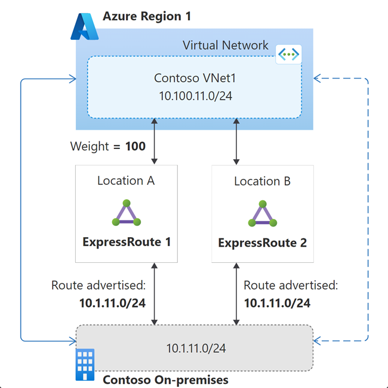

# ExpressRoute Connectivity

[prev](./vpn-connectivity.md) | [home](./readme.md)  | [next](./private-endpoints.md)

## Why use ExpressRoute?

- Lower and more consistent latency and throughput is required
- VPN connectivity does not provide required consistency or bandwidth
- Private connectivity to Microsoft cloud services

## Where do I start?

- Talk to your current connectivity provider first
- For new environments, review the list of [**providers and peering locations**](https://docs.microsoft.com/azure/expressroute/expressroute-locations-providers)
- ExpressRoute [**configuration workflow**](https://docs.microsoft.com/azure/expressroute/expressroute-workflows)

## Configuring ExpressRoute Connectivity

ExpressRoute is a connection to Microsoft, which can in turn be used to connect to Azure other Microsoft cloud services.

- **Circuit**: ExpressRoute configuration resource for provider, bandwidth, billing type, routing, etc.
  - Circuit SKU affects number of connected VNets, scope of connectivity, number of route prefixes, and M365 access
  

- **Circuit Bandwidth**:
  - Purchase options are 'metered' or 'unlimited', indicating how egress traffic will be charged (ingress is free). 'Metered' is more cost-effective at lower utilization (less than ~70% sustained)
  - Because connection is redundant, you have 2x the purchased bandwidth available but no resiliency over your purchased amount
  - Bandwidth can be increased, as long as the provider has capacity on your connection

- [**ExpressRoute Peering Types**](https://docs.microsoft.com/azure/expressroute/expressroute-circuit-peerings): peering types determine the services connected to over ExpressRoute.
  - *Private Peering*: connect to your private Azure resources via an ExpressRoute VNet Gateway
  - *Microsoft Peering*: connect to Microsoft services, including PaaS services, Microsoft 365, and Dynamics
  - *Public Peering*: legacy version of Microsoft Peering

- [**Routing Requirements**](https://docs.microsoft.com/azure/expressroute/expressroute-routing): Microsoft peering requires registered ASN and public IP addresses; private peering can use private IPs and ASNs

- [**High-availability and Disaster Recovery**](https://docs.microsoft.com/azure/expressroute/designing-for-high-availability-with-expressroute):

  

  - Use multiple peering locations and providers for maximum resiliency
  - For Private Peering, remember that your ER peering location the same as your region Azure datacenters and could be impacted separately

- [**Pricing**](https://azure.microsoft.com/pricing/details/expressroute/): For Private Peering, account for Circuit, Gateway, egress, and carrier charges

### Advanced Scenarios

- [**Coexistence of ExpressRoute and VPN Gateways**](https://docs.microsoft.com/azure/expressroute/expressroute-howto-coexist-resource-manager)
  - [Provide a failover for ExpressRoute connectivity](https://docs.microsoft.com/azure/cloud-adoption-framework/ready/azure-best-practices/plan-for-ip-addressing)
  - Connect branch locations to Azure
  - [Encrypt traffic over ExpressRoute](https://docs.microsoft.com/azure/expressroute/site-to-site-vpn-over-microsoft-peering) to meet regulatory requirements