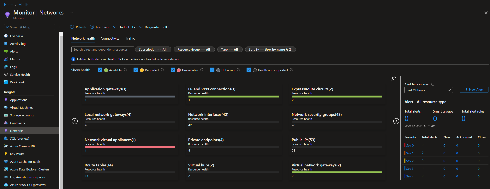
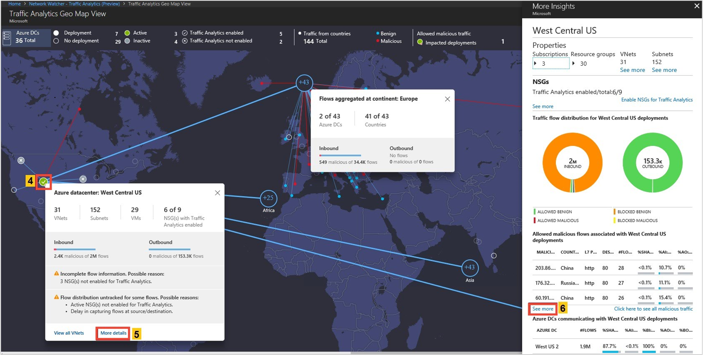

# Management

[prev](./security-advanced.md) | [home](./readme.md)  | [next](./faq.md)

## Azure Monitor Network Insights

Azure Monitor's Network Insights page provides a quick dashboard of network component status and health across your subscriptions. Use it to quickly locate problems in your network.

## Azure Network Watcher

Azure Network Watcher provides tools to monitor, diagnose, view metrics, and enable or disable logs for resources in an Azure virtual network. Network Watcher is designed to monitor and repair the network health of IaaS (Infrastructure-as-a-Service) products which includes Virtual Machines, Virtual Networks, Application Gateways, Load balancers, etc. Note: It is not intended for and will not work for PaaS monitoring or Web analytics.

[What is Azure Network Watcher?](https://docs.microsoft.com/azure/network-watcher/network-watcher-monitoring-overview)

## Flow logs

Network security group (NSG) flow logs is a feature of Azure Network Watcher that allows you to log information about IP traffic flowing through an NSG. Flow data is sent to Azure Storage accounts from where you can access it as well as export it to any visualization tool, SIEM, or IDS of your choice.

[Introduction to flow logging for network security groups](https://docs.microsoft.com/azure/network-watcher/network-watcher-nsg-flow-logging-overview)

### Traffic analytics

Traffic Analytics is a cloud-based solution that provides visibility into user and application activity in cloud networks. Traffic analytics analyzes Network Watcher network security group (NSG) flow logs to provide insights into traffic flow in your Azure cloud.

[Why traffic analytics?](https://docs.microsoft.com/azure/network-watcher/traffic-analytics)

## Troubleshooting

1. Do not rely on ICMP it will get dropped at specific points.
1. Most endpoints are not ping'able, such as your VPN Gateway endpoint.

[Introduction to variable packet capture in Azure Network Watcher](https://docs.microsoft.com/azure/network-watcher/network-watcher-packet-capture-overview)

### Effective routes

- Diagnostic property located on a Network Interface Card resource.
- Dynamically updated and requires the NIC to be attached to a running VM.

[Diagnose a virtual machine routing problem](https://docs.microsoft.com/azure/virtual-network/diagnose-network-routing-problem)

### Effective network security rules

- Diagnostic property located on a Network Interface Card resource.
- Dynamically updated and requires the NIC to be attached to a running VM.

[Diagnose a virtual machine network traffic filter problem](https://docs.microsoft.com/azure/virtual-network/diagnose-network-traffic-filter-problem)

### Packet capture

Network Watcher variable packet capture allows you to create packet capture sessions to track traffic to and from a virtual machine. Packet capture helps to diagnose network anomalies both reactively and proactively. Other uses include gathering network statistics, gaining information on network intrusions, to debug client-server communications and much more.

Portal link: [Network Watcher | Packet capture](https://ms.portal.azure.com/#blade/Microsoft_Azure_Network/NetworkWatcherMenuBlade/packetCapture)

### Azure Serial Console

The Serial Console in the Azure portal provides access to a text-based console for virtual machines (VMs) and virtual machine scale set instances running either Linux or Windows. This serial connection connects to the ttyS0 or COM1 serial port of the VM or virtual machine scale set instance, providing access independent of the network or operating system state. The serial console can only be accessed by using the Azure portal and is allowed only for those users who have an access role of Contributor or higher to the VM or virtual machine scale set.
