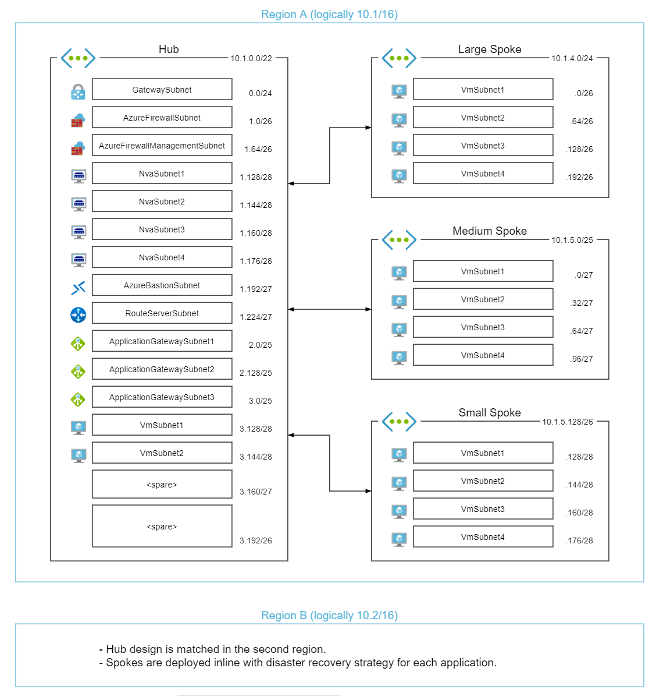
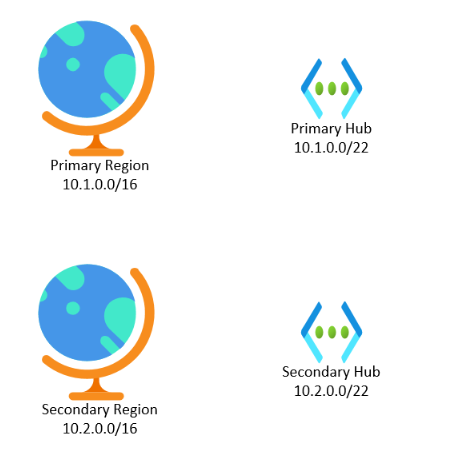
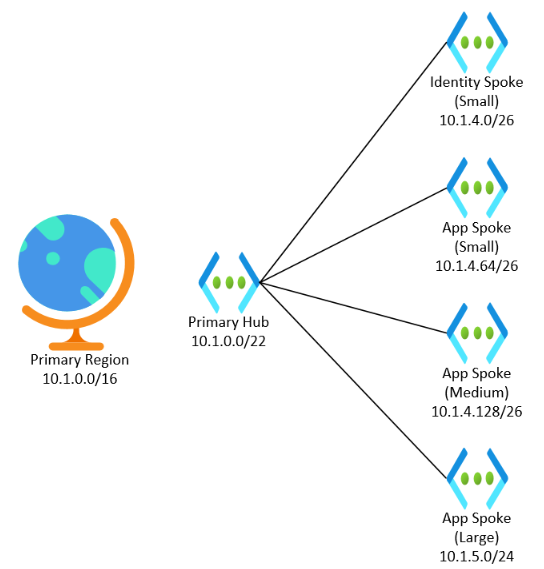

# Topology (Advanced)

#### [prev](./connectivity.md) | [home](./readme.md)  | [next](./security-advanced.md)

## IP Address Management for Hub and Spoke Vnets

A working example for a hub and spoke topology.

[Reference IP Schema](./example-ip-plan/example-ip-plan.md)

### Planning Regional Supernets

To help give continuity to your IP schema, you can plan to have a supernet to refer to a specific region or scope.  A /16 supernet is a good place to start, giving plenty of room for expansion.

This assignment does not have a technical representation in Azure; there is no supernet resource in Azure that you assign resources to.  Instead you are tracking it in your IP Address Management system, which could be something like [Windows Server IPAM](https://docs.microsoft.com/windows-server/networking/technologies/ipam/ipam-top) or even a simple spreadsheet.

To start, you should plan for IP spaces in at least two regions: your primary region, and that region's [paired region](https://docs.microsoft.com/azure/availability-zones/cross-region-replication-azure).  While you might not need a secondary region right away, it is helpful to build this in to your IP address plan.

### Planning your Hub IP Space

Hubs contains shared connectivity resources.  You should plan a hub for each region, and plan for it to be a larger vnet.

The recommended size is /22s, allowing for:

* A /24 for the Gateway Subnet
* A /26 for the Azure Firewall Subnet
* A /26 for an Azure Firewall Management Subnet (if needed)
* A /27 for Azure Bastion
* Room for VMs, Application Gateways, and third party solutions
* Ample room for expansion for new services

>If IP space limitations require reduction, you can reduce this size based off of the resources that you need in the hub and how you want to autoscale.  However, this can create challenges later as you expand.  You shouldn't downsize your hub because you *might* have issues, but if you have a clear understanding of issues that *will* occur.

You may also think about having a seperate hub for different environments if you need to seperate out network infrastructure.  This requires additional work and management, and so should only be adopted if you have a clear business case for separating out the network.  Common examples for this include:

* A requirement that only data of different sensitivities cannot use the same network appliances (The corporate and PCI networks can't share the same appliances)
* Different roles and access to network resources based on the sensitivity of the data that it manages (Delegating access to development shared connectivity to a different team than production shared connectivity)
* Using Infrastructure-as-Code to deploy and manage connectivity resources in a CI/CD fashion, and a requirement for a "non-production" network

### Planning for your Spoke IP Space

Spoke vnets are dynamic and map to an application or group of (heavily) related applications.  They are also often separated by environment, meaning that one application might have two virtual networks, one for Dev/Test and another for Prod.  Spoke vnets vary in size but are usually smaller rather than larger and subnets align to the application's requirements.  

Because spoke vnet size is dynamic, it can be helpful to create t-shirt sizes for virtual networks.  

Example sizes might be:

T-shirt Size| CIDR Size | Suited for | Hosts |
---|---|---|---|
Small | /26 | Small simple applications without much tiering or autoscaling  | 64 *minus 4 per subnet* |
Medium | /25 | More complex applications that have more tiering or autoscaling, or are broken in to smaller services  | 128 *minus 4 per subnet*
Large | /24 | Applications that have multiple tiers, and use vnet integration with app services, SQL services, or Azure Kubernetes Services **OR** a workload made up of multiple simple applications | 256 *minus 4 per subnet* |
Extra Large | /23 | A workload made up of multiple complex applications, or that uses services with significant IP address considerations  | 512 *minus 4 per subnet* |

Individual spokes should be pulled from the same supernet as their hub, and peered to the hub.  Stubbing out similar virtual networks in the secondary region can help you prepare for disaster recovery events.

Other services, like Identity, can also go in their own spokes.

>In migration scenarios, refactoring applications to use virtual network and subnet segmentation is recommended.  However, in some migrations, all source devices are replicated in to a single virtual network segmented by subnets.  In this scenario, a single virtual network might represent all workloads running in a source environment.

## Considering Other Topologies

There is no golden topology that will fit every workload scenario.  It is helpful to think about your requirements and use materials to make decisions early on in the process.

* Consider the workload.
* Consider availability requirements (including global and regional).
* Consider peering costs.
* Don't underestimate hidden costs and administrative overheads.

This might lead you to adopt a stand alone vnet, vnet mesh, or some other topology.

## Hub and Spoke with Azure VWAN

You can use an Azure Virtual WAN and regional Virtual Hubs instead of a Virtual Network for managing your hub layer.

Once you deploy a Virtual WAN, you will then deploy multiple Virtual Hubs.  These can have the same sizing as your Virtual Network Hub, and so shouldn't impact your IPAM plan.  One exception is if you need to shift other resources outside of the hub, so keep that in mind.

You will then create connections from the hub to the spoke networks from within the Virtual WAN itself.

Deployment of Gateways and Firewalls will occur from within the Virtual WAN/Virtual Hub interface, and you can also manage items as well.

Also, you should make sure your [routing scenario is one of the supported patterns](https://docs.microsoft.com/azure/virtual-wan/scenario-any-to-any).

### Use Case for Azure VWAN

Azure Virtual WAN is a service that allows for improved throughput and management of virtual networks, but are managed very differently.  The advantages are:

* Azure Virtual WAN provides more tunnels to on-prem networks (called branches).
* Provides greater network throughput through the hub from these tunnels (but does not increase the throughput of each tunnel).
* Provides a way to define routes and configure auto-learning of routes, and "push" them to spoke virtual networks.

It can be a powerful tool, but it comes with some limitations

* Because the Virtual WAN hubs are software defined, you cannot put your own resources in them; only Azure Firewalls, Virtual Network Gateways, ExpressRoute Gateways, and specific third party NVAs can be deployed in.
* Route Tables have interactions with the Azure VWAN published routes, which can add complexity if an environment has unique routing concerns.
* While VWAN allows for Any-to-Any between branches and spokes, this is disabled if you use the Secure Hub format and deploy an Azure Firewall in the hub.

With this in mind, you should consider carefully if you wish to use Azure Virtual WAN, and what it means for your environment.

### Routing with Virtual Hubs

Routing with spoke networks connected to VWAN Hubs works differently than normal routing.  A virtual hub has route tables associated with it by default:

* **Default** - Which is the standard route and assumed to be the one in use
* **None** - Which is intended to be empty, and used for when a virtual network should not have additional routes assigned to it.

You can add your own to match different patterns.  Route tables in the Virtual Hub are assigned labels, so they can be managed in groups.

In addition to static routes inputted in to the route tables, when you go to connect spokes to the virtual hub, you will select what route tables to associate and which to propogate to.

The route table that you select for **Associated Route Table** will be used by the network; it becomes the default route definitions for all subnets in the virtual network.  UDRs can still be used to overwrite these routes.

The route table(s) that you select for **Propogate to Route Tables** will be the route tables that learn the routes associated with this Virtual Network.  **Propogate to labels** applies to all route tables with that labels.

You can also specify static routes in this connection.

Imagine if you had two network segments, Red and Blue.  You could use route tables to control traffic from Red and Blue networks in different ways.

## DNS Zones in Azure

>This is in addition to the DNS discussion in **[Vnet Basics](basics.md)**.  From that discussion, you should be aware of:

> * How VMs send DNS requests to the Azure backbone
> * How to direct Azure DNS requests to a DNS server or service

### Public DNS Zones

Public DNS zones (just called DNS zones) are hosted namespaces that perform domain resolution for names.  Inside of the Zone, you are able to list DNS records like you would in any common DNS systems.  One key limitation is that Private DNS zones do not do conditional forwarding.

Creating a DNS Zone does not register the domain name.  That process still requires the work of a registrar, although more Azure services allow domain registration bundled with them.

Once you create an Azure DNS zone, you will have a list of name servers available for the zone.  You will have to set these as the name servers in the registrar that you registered the domain with.

Once completed, public resolution of your name space will occur against your Azure DNS zone.

### Private DNS Zones with Azure Native DNS

Private DNS Zones are namespaces that allows you to perform name resolution.  Inside of the Zone, you are able to list DNS records like you would in any common DNS systems.  One key limitation is that Private DNS zones do not do conditional forwarding.

Once you create a Zone, you can link it to your virtual networks.  Once linked, these records will be available whenever resources the virtual networks default DNS lookup feature.  A virtual network can be linked to multiple Private DNS zones, and the Private DNS zone can be linked to multiple virtual networks.

When you link a virtual network to a DNS zone, you can also select to enable auto registration.  If auto registration is enabled, virtual machines deployed to the virtual network will add themselves to the DNS zone.

For example, if we have the private DNS zone *contoso.com* linked to VNET1 with registration enabled, when VM1 is created on VNET1 it will create a record for VM1.contoso.com.

A virtual network can only register to one DNS zone, but multiple virtual networks can register to the same DNS zone.

### Hybrid Private DNS

Because of the inability to do conditional forwarding, and integration of existing DNS systems, organizations often use Private DNS zones along with their existing DNS systems in a hybrid configuration.

In this configuration, the virtual network DNS targets are set to the VMs that house the DNS system.  This performs the first level of resolution, and allows for non-Azure corporate resources to be resolved easily.

However, for any names in a Private DNS zone, the DNS system can forward that traffic to the Azure DNS resolver. This can be done by creating a conditional forward for that domain, forwarding to the IP address **168.63.129.16** from within and Azure virtual network.  This IP address will then perform the lookup and return the value.

### Private DNS and Private Endpoints

In order to leverage Private Endpoints, you will need to configure DNS appropriately.

When you enable Private Endpoints on a PaaS service, its public DNS record will change from resolving to an IP, to resolving to an alias that will then need to be looked up.  So if your host name for the service is myservice.azureservices.net, instead of resolving to an IP address, it will resolve to myservice.privatelink.azureservices.net.

With that in mind, you need to have a resolution in your DNS solution to resolve the alias.  If you enable a Private DNS Zone along with the Private Endpoint through the portal experience, it will be attached the virtual network and function appropriately by default.  

However, if you want resolution from on-prem - or if you want to use the hybrid private DNS topology discussed above - you will have additional considerations.

There are many different configurations that can support this, but in general you should:

* Use public DNS public name (non-privatelink) to the privatelink name
* Use your private DNS to resolve the privatelink name (either with a record in your DNS zone, or by forwarding to a Private DNS Zone)

Although difference services structure their host names in different ways, so pay attention to each service.

See [Private endpoint DNS integration](https://docs.microsoft.com/azure/private-link/private-endpoint-dns) for more details

## Private connectivity to PaaS resources

We recommend adopting strategies like Zero Trust and moving the focus from network perimeters to Identity. However not everyone or system can make this shift today. We have increasing support for private access to normally public services. There are a few different approaches to this:

* [Dedicated Service](https://docs.microsoft.com/azure/virtual-network/virtual-network-for-azure-services) - Deploy dedicated but managed infrastructure inside your VNet e.g SQL Managed Instance or App Service Environment
* [Service Endpoint](https://docs.microsoft.com/azure/virtual-network/virtual-network-service-endpoints-overview) - Allow ACLd Access to a public endpoint, firewall other access. Not accessible from remote networks
* [Private Endpoints](https://docs.microsoft.com/azure/private-link/private-endpoint-overview) - Provision private ip address in the virtual network that will enable access to public resource. Not supported for all services see [Availbilty](https://docs.microsoft.com/azure/private-link/private-link-overview#availability)

OPINION:
>Relying heavily on these mechanisms will make integration increasingly difficult, some services will have a loss of features when IP addresses are restricted. Remember many of the services were designed for a public cloud. Examples:

>* [Azure SQL import/export service](https://docs.microsoft.com/azure/azure-sql/database/network-access-controls-overview#allow-azure-services)
>* Managing some storage account settings from the portal [Storage Recommendations](https://docs.microsoft.com/azure/storage/blobs/security-recommendations#networking)
>* Using PowerBI to easily integrate with data services

### Alternatives to private connectivity

You may not need a full hybrid network to support your workloads. Some services offer their own connectivity options which might be worth exploring if you only need connectivity for 1 or two solutions.

Examples:

* [Azure Relay](https://docs.microsoft.com/azure/azure-relay/relay-what-is-it)
* [Data Gateway](https://docs.microsoft.com/en-us/data-integration/gateway/service-gateway-onprem)
* Exposing services using [Mutual Certificate Authentication](https://docs.microsoft.com/azure/api-management/api-management-howto-mutual-certificates)