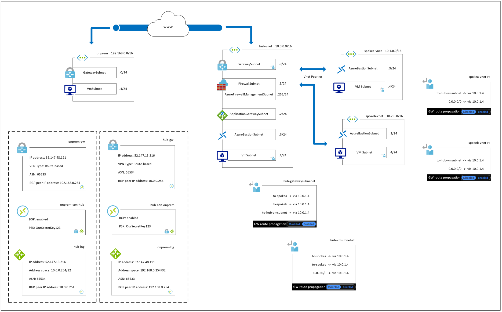

# Topology Overview

#### [prev](./basics.md) | [home](./readme.md)  | [next](./routing.md)

## Hub and Spoke

The most common enterprise network architecture is the **Hub and Spoke** network topology leveraging virtual networks.  It is well defined in [the reference architecture](https://docs.microsoft.com/azure/architecture/reference-architectures/hybrid-networking/hub-spoke?msclkid=02170518bcee11eca7a5301ea8a57ecd&tabs=cli).

The key benefits of Hub and Spoke are:

- Cost savings by allowing for a shared network infrastructure for items that would be used between multiple workloads
- Overcoming subscription limits by allowing a shared set of infrastructure in its own subscription to be used
- Workload isolation, as each spoke network is its own security boundary
- Permissions isolation, as it is easier to restrict access to the virtual networks in the topology

The *Hub* virtual network acts as a set of connectivity/networking resources, shared between spoke networks.  It typically contains:

- Network Gateways for VPN or ExpressRoute connections, allowing for connectivity with on-prem resources
  - Sometimes third party network virtual appliances (*NVAs*) are used instead of Network Gateways
- Azure Firewalls or other Firewall NVAs that provide security for traffic flowing between spokes and remote sites
- Azure Bastion to let you securely connect to virtual machines in the topology

Sometimes the hub can also contain other shared workloads, such as domain controllers for enterprise identity, or vulnerability scanners.  However, there are pros and cons of using this path.

The *Spoke* virtual networks act as a security boundary around a set of resources in Azure.  Depending on your organization, it might be one workload, or a set of workloads, or a whole environment of workloads inside of one virtual network.  You can connect it to contain:

- Azure Virtual Machines and Scale Sets
- Service Endpoints for PaaS services
- Private Endpoints for high risk PaaS services
- Managed instances that are deployed on virtual machines, such as SQL Managed Instances or Azure Kubernetes Services
- Integration subnets for Web Applications

The Hub and Spokes are peered together, meaning that every spoke is able to route traffic to the hub, and the hub to every spoke.  However, the spokes are not able to route to each other, without going through a resource at the hub (such as an Azure Firewall).

This means that workloads in different spokes are protected from each other by default.

We will talk more about this in the [Routing](routing.md) and [Security](security.md) sections.

A more [detailed](./topology.md) breakdown of the hub and spoke topology is covered after introducing connectivity and routing.
