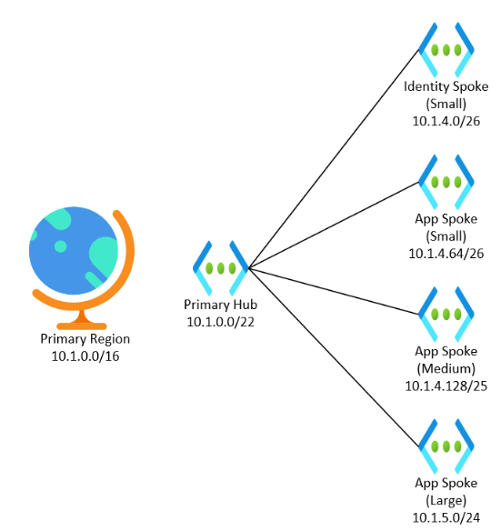

# IP Address Management for Hub and Spoke Vnets

**[prev](./connectivity.md) | [home](./readme.md)  | [next](./security-advanced.md)**

A working example for a hub and spoke topology.

[Reference IP Schema](./example-ip-plan/example-ip-plan.md)

## Planning Regional Supernets

To help give continuity to your IP schema, you can plan to have a supernet to refer to a specific region or scope.  A /16 supernet is a good place to start, giving plenty of room for expansion.

This assignment does not have a technical representation in Azure; there is no supernet resource in Azure that you assign resources to.  Instead you are tracking it in your IP Address Management system, which could be something like [Windows Server IPAM](https://docs.microsoft.com/windows-server/networking/technologies/ipam/ipam-top) or even a simple spreadsheet.

To start, you should plan for IP spaces in at least two regions: your primary region, and that region's [paired region](https://docs.microsoft.com/azure/availability-zones/cross-region-replication-azure).  While you might not need a secondary region right away, it is helpful to build this in to your IP address plan.

## Planning your Hub IP Space

Hubs contains shared connectivity resources.  You should plan a hub for each region, and plan for it to be a larger vnet.

The recommended size is /22s, allowing for:

* A /24 for the Gateway Subnet
* A /26 for the Azure Firewall Subnet
* A /26 for an Azure Firewall Management Subnet (if needed)
* A /27 for Azure Bastion
* Room for VMs, Application Gateways, and third party solutions
* Ample room for expansion for new services

>If IP space limitations require reduction, you can reduce this size based off of the resources that you need in the hub and how you want to autoscale.  However, this can create challenges later as you expand.  You shouldn't downsize your hub because you *might* have issues, but if you have a clear understanding of issues that *will* occur.

You may also think about having a seperate hub for different environments if you need to seperate out network infrastructure.  This requires additional work and management, and so should only be adopted if you have a clear business case for separating out the network.  Common examples for this include:

* A requirement that only data of different sensitivities cannot use the same network appliances (The corporate and PCI networks can't share the same appliances)
* Different roles and access to network resources based on the sensitivity of the data that it manages (Delegating access to development shared connectivity to a different team than production shared connectivity)
* Using Infrastructure-as-Code to deploy and manage connectivity resources in a CI/CD fashion, and a requirement for a "non-production" network

## Planning for your Spoke IP Space

Spoke vnets are dynamic and map to an application or group of (heavily) related applications.  They are also often separated by environment, meaning that one application might have two virtual networks, one for Dev/Test and another for Prod.  Spoke vnets vary in size but are usually smaller rather than larger and subnets align to the application's requirements.  

Because spoke vnet size is dynamic, it can be helpful to create t-shirt sizes for virtual networks.  

Example sizes might be:

T-shirt Size| CIDR Size | Suited for | Hosts |
---|---|---|---|
Small | /26 | Small simple applications without much tiering or autoscaling  | 64 *minus 4 per subnet* |
Medium | /25 | More complex applications that have more tiering or autoscaling, or are broken in to smaller services  | 128 *minus 4 per subnet*
Large | /24 | Applications that have multiple tiers, and use vnet integration with app services, SQL services, or Azure Kubernetes Services **OR** a workload made up of multiple simple applications | 256 *minus 4 per subnet* |
Extra Large | /23 | A workload made up of multiple complex applications, or that uses services with significant IP address considerations  | 512 *minus 4 per subnet* |

Individual spokes should be pulled from the same supernet as their hub, and peered to the hub.  Stubbing out similar virtual networks in the secondary region can help you prepare for disaster recovery events.

Other services, like Identity, can also go in their own spokes.

>In migration scenarios, refactoring applications to use virtual network and subnet segmentation is recommended.  However, in some migrations, all source devices are replicated in to a single virtual network segmented by subnets.  In this scenario, a single virtual network might represent all workloads running in a source environment.
