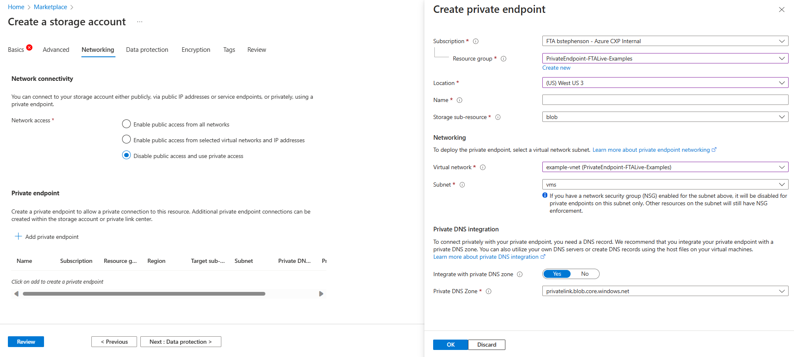
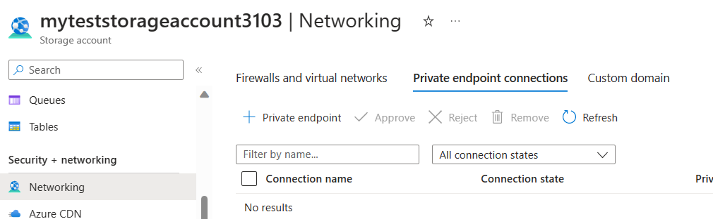
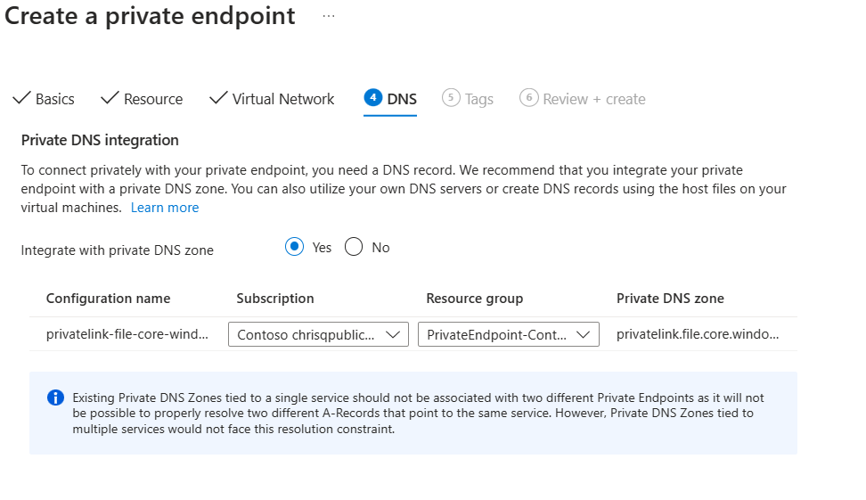
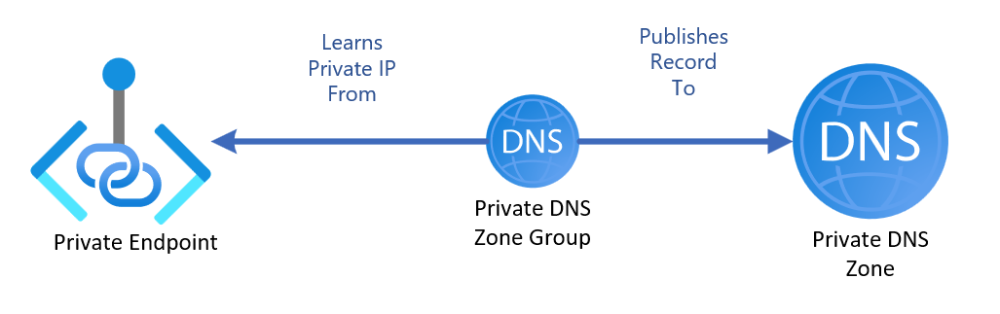
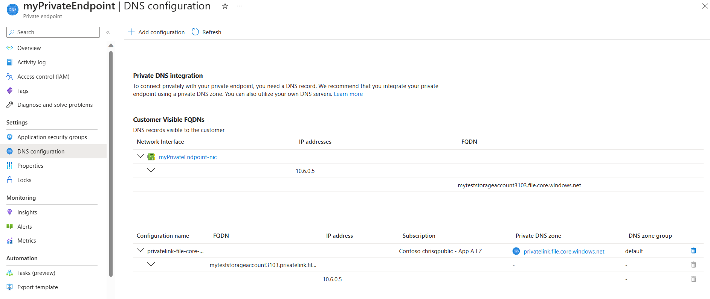

# DNS Private Endpoint Concepts -  what you need to know for Private Endpoints

[prev](./overview.md) | [home](./readme.md)  | [next](./dns-pe-scenarios.md)

> **NOTE**
> This is not an over all guide for DNS in Azure, but rather specific guidance for Private Endpoints.  We will need to talk about some Private DNS Zone management concepts as part of this.

Your *Domain Name System* or DNS is a critical part of your Private Endpoint configuration.  Most Private Endpoint implementations run in to challenges at this level, so having a clear plan for how you are resolving the names of the private endpoints is critical.

The guide for [DNS resolution for Private Endpoints](https://learn.microsoft.com/azure/private-link/private-endpoint-dns) covers this information in detail - but this portion is to make some of the concepts in the broader document actionable.

## Why can't I just use my own DNS and manually update IP addresses?

You *can* but management for that will become very difficult.  It involves constant management as resources are created and destroyed, which can involve a lot of back and forth.  It can create delays with onboarding Azure resources (deploying a new resource will require a change to DNS), and will create issues with short lived resources.

## Why can't I use my own Zone Name?

A common challenge is that organizations wish to use their own zone names for the resources.  While some services offer the option to set custom domain names, most need to use the existing domains.  This is because the certificates used for communication are set to expect specific CN records; if you change these, the traffic will not be permitted.

## DNS Options in Azure

There are three primary options to consider for creating DNS records for your Private Endpoint resources:

- **Private DNS Zones:** Private DNS Zones are Azure's native Private DNS offering and integrate with the default Azure-provided DNS service. Using Private DNS Zones with your Private Endpoints enables automated DNS record management for your Private Endpoints, improving scale and ease of management.
- **Custom DNS servers:** Custom DNS servers are when you bring your own DNS servers to Azure point your DNS clients to them. Commonly, these are Windows Domain Controllers hosting an extension of your on-prem DNS services. Custom DNS servers can be combined with Private DNS zones to provide both the consistency of your extended DNS service and the flexibility of Private DNS Zones. Alternatively, you can skip Private DNS Zones altogether and create 'A' DNS records for your Private Endpoints directly in your Custom DNS server--this is usually not recommended because it scales poorly without significant automation investment.

## Private DNS Zone Management

When using Private DNS Zones as the DNS name registration solution for your Private Endpoints requires some upfront consideration. Determining where your Private DNS Zone resources will be located and how they will be shared should be done before bringing Private Endpoints into production.

### Private DNS Zone Duplication

There are many ways to deploy your Azure Private DNS Zones - you can have duplicate zones through the environment, or one zone for each namespace that is reused.

Because a given virtual network (or VM if you are setting it there) can only have one set of DNS servers listed, and a virtual network can only have one zone of a given namespace to it, it makes sense to have a central set of zones that are shared between workloads.  This reduces management, and ensures cross workload resolution.

This is most commonly used in a hub and spoke methodology, such as:

You can read more about this [here](https://learn.microsoft.com/azure/architecture/guide/networking/private-link-hub-spoke-network).

In a standard ALZ approach, your DNS zones should exist in your connectivity subscription.  They are shared resource used by every spoke VNET that you deploy for resolution, and so individual groups shouldn't deploy out their own Private DNS Zones.

If you are using an Azure Landing Zone, you will most likely already have these resources created!

However, this requires some diligence to maintain.  When you are deploying an Azure resource, you are often going to be provided the option to set up a Private Endpoint as part of resource deployment.

This can work great for some environments, but note that creating the private endpoint doesn't ask you where the Private DNS Zone is located.  Instead, if you select the private DNS integration option, it will check the resource group that you are deploying the private endpoint in to.  This means it will often create its own Private DNS Zone, leading to duplication and mixup.  It will also attach the private DNS zone to the network, which will create issues in most environments.

If you are testing a single VNET implementation, this can be fine.  But for most environments, it will make sense to deploy the Private Endpoint after the resource is created.

>**NOTE**
> If you are using Infrastructure as Code, you can deploy out a Private Endpoint with the resource with the specific parameters that you need.  These instructions are for Portal deployments.

To do so, navigate to your resources networking tab, go to Private Endpoints tab, and then select **+ Private Endpoint**.

From this wizard you will be prompted to provide parameters.  When you get to **Step 4 - DNS** you will get the option to integrate with a Private DNS zone, and you will be able to select an existing DNS zone in a different subscription and resource group.

### Private DNS Zone Groups

There are two main ways that the record for your private endpoints can end up in the appropriate Private DNS Zone.

The first, and more common, method is to use Private DNS Zone Groups.  Private DNS Zone Groups are a configuration of the Private Endpoint that associate it with a specific group for registration, meaning that it handles its registration for you.  When a PE is removed, the removal of the Zone Group ensures that its record is removed from the DNS zone.

While you can have multiple configurations for different name spaces, a private endpoint can only have one configuration for a specific namespace.  So in this scenario, the Private DNS Zone Group links to the authoritative namespace for the solution.

Second, you can manually enter them.  This works well if you need to maintain multiple DNS zones for the same name space, but isn't a common scenario.  Not only do you need to have a method to add records, you also need to clean up records when Private Endpoints are retired.  The management of this can become cumbersome, meaning that you should plan to automate it.

[prev](./overview.md) | [home](./readme.md)  | [next](./dns-pe-scenarios.md)
