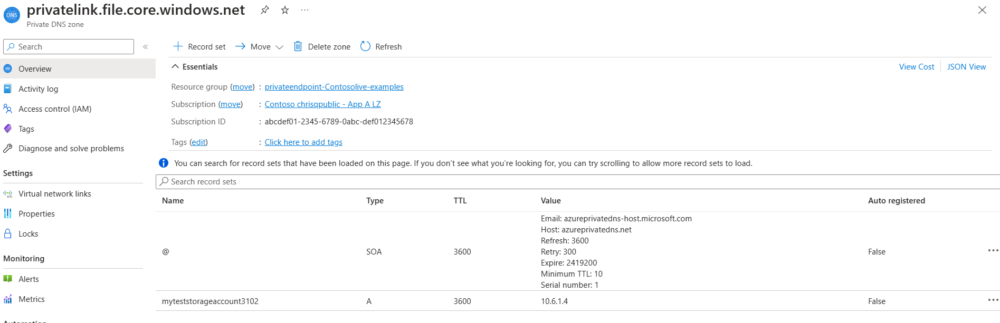
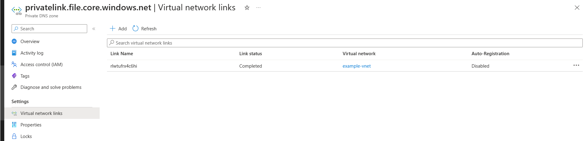
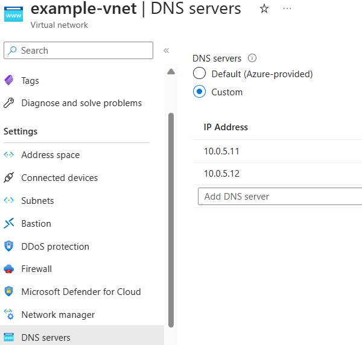
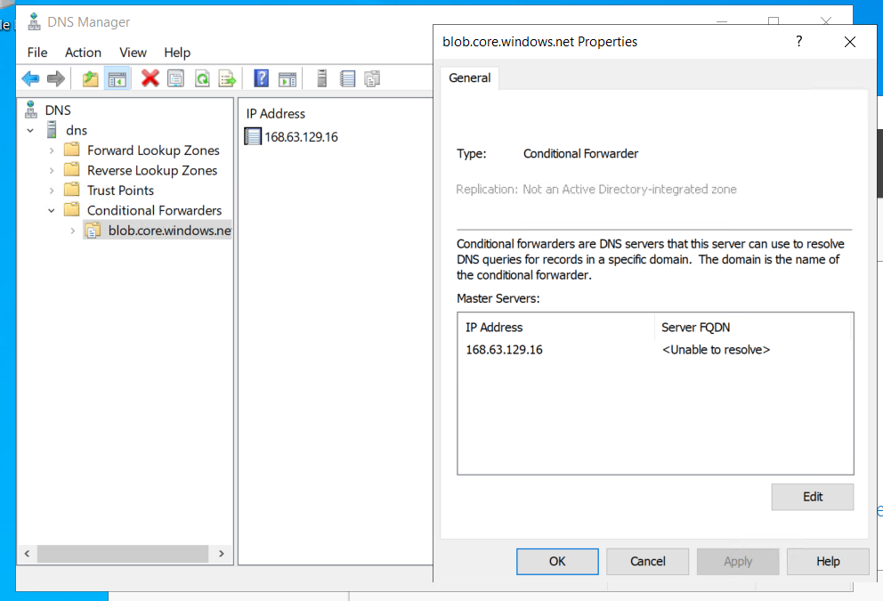
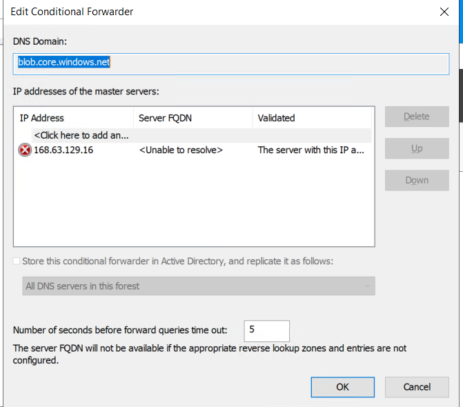

# Private Endpoint Resolution Scenarios

Now that we have some of the main concepts for DNS and Private Endpoints matched out, lets talk about the three resolution scenarios that you can plan to adopt:

- **Private DNS Zone Only** - for environments that are hosted in Azure and only need to resolve private IPs backed by Azure Private DNS Zone.
- **Custom DNS Resolution in Azure** - for environments that are hosted in Azure and need to resolve private IPs back by Azure Private DNS Zone as well as by your DNS forwarder, such as Azure Firewall with DNS Proxy, Windows Server DNS, Infoblox, or some other solution.  Azure Private DNS Resolver can also come in to play here.
- **Hybrid DNS Resolution** - for the environments hosted in Azure or in other data centers, that need to be able to resolve to each other.  Effectively, Azure-to-Azure, Azure-to-On-Prem, and On-prem-to-Azure are needed.

Most customers will need **Hybrid DNS Resolution**, and you should be prepared to implement that.  However, discussing these different solutions helps you build up an understanding of why you need that solution, and can help you with troubleshooting later.

In whatever DNS solution you are using, you add a record for your private resource, using the Public DNS zone forwarders found [here](https://learn.microsoft.com/azure/private-link/private-endpoint-dns#azure-services-dns-zone-configuration).

One major call out is that Private DNS Zones and Conditional Forwarders are not always 1:1.  For example, Key Vault requires forwarders for `vault.azure.net` & `vaultcore.azure.net`, but a Private DNS Zone for `privatelink.vaultcore.azure.net` only.  Implementing just one of the forwarding zones can create intermittent issues and caching of the incorrect IP address, creating issues.  Consult the table in the above article to plan your DNS needs for a service.

## Private DNS Zone Only

This is the simplest configuration, and a great place to start when testing the flow.  In production, this would only be used for an environment where you can perform *all* of your Private IP resolution from an Azure Private DNS Zone.

The over all flow for DNS resolution here is:

In this scenario...

- The Client VM will use the Azure provided DNS resolver, which is configured as the default on virtual networks, to send its DNS requests to the 168.63.129.16 magic IP.
- This service then performs the recursive lookup to return the correct IP, enabling resolution to the Private Endpoint.

When you set it up, the Private DNS zone should have the following settings:

## Custom DNS Resolution in Azure

Custom DNS Resolution in Azure tends to be used by organizations that do not have a physical data center, but have an Azure footprint that is a mix of traditional domain-joined VMs and non-VM services.

The following diagram can help envision the scenario:

In this scenario...

- The Spoke VM will use the DNS Forwarders in the hub as their DNS resolvers.  When they make any DNS query, it is sent to these forwarders.
- These forwarders have a mechanic to forward DNS requests for the zone in question to the Azure provided DNS service.
- Once the request is forwarded, the Azure provided DNS operates as in the first scenario.
- The DNS forwarders return the requested IP to the spoke VM.

It should be noted that these DNS forwarders can be many different kinds of resources, such as:

- Azure Private DNS Resolvers
- Windows Server DNS Server or AD Domain Controller
- An Azure Firewall with DNS Proxy enabled
- A third party DNS solution

When setting this up, the DNS zone should be connected to the virtual networks where the DNS forwarding mechanics are.

If you are using a Windows Server DNS, the conditional forwarder to send the traffic to the Azure IP would look like:

### Conditional Forwarders in Windows Server

If you are using an AD domain controller or a DNS server for forwarding, your conditional forwarder should look something like:

Other options for DNS forwarding will have their own options.

## Hybrid DNS Resolution

This scenario is the most common used by organizations in the field, because it allows for you to resolve Azure private endpoints from on-prem, and also builds in the ability to resolve on-prem resources from Azure.  While it has the most complex setup, it provides the best management moving forward, and is very resilient.

This scenario builds upon the concepts already established in the other two scenarios.

The following diagram can help us envision the scenario:

In this scenario, Azure resources operate in the same fashion as the above scenario, with the addition that the DNS forwarders in Azure are either able to resolve on-prem FQDNs, or will forward traffic to the on-prem DNS servers for resolution.

On-prem resources will operate in the following way:

- The on-prem Client VM will send a DNS request to their Internal DNS server.
- The DNS server has a conditional forwarder to the DNS forwarder in Azure.  It will navigate there over the VPN or ExpressRoute.
- Once there, the DNS forwarder will behave as in the previous scenario, sending to the private DNS resolver for recursive look up.
- The responses will be returned, and the Client VM can access the endpoint over the VPN or ExpressRoute.

As new resources are deployed to the Private DNS Zone, no additional configuration on the internal DNS is needed.  You do need to add a new conditional forwarder for net new zones, but management afterwards is reduced.
