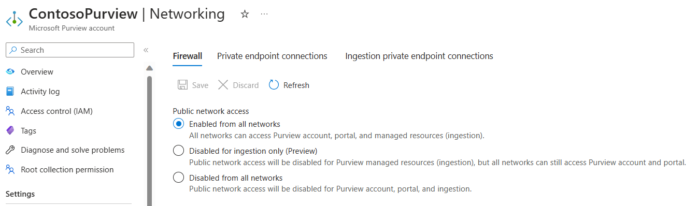

# Special Case - Azure Data Factory, Synapse, and Purview

[home](./readme.md)

Azure Data Factory, it's successor Synapse, and the data governance tool Purview all have special considerations for Private Endpoint.

While these services are different, they do have a shared set of commonalities

## Portal Access

First, these services have their own UIs that are part of the service.  This is a type of data-plane access that is used to configure runtimes, build data flows, and access secrets.

As a result, you can plan to use a Private Endpoint to securely access the Account and Portal functions to manage the instance, as well as for ingestion.

Some organizations don't feel the need to secure the account and portal functions - the use of MFA and firewall settings to allow for more isolated access, but only use the Private Endpoints for data transfers.

## Integration Runtimes

In addition to this access, the actual data scans transfers for these services use a component called an *Integration Runtime*.  These runtimes do the actual compute work, and are what access the data sources to perform scans or extract/transform/load the data in question.

Azure-hosted Integration Runtimes are provided, but because these run as an Azure service and not in your private network, they would not have access to resources that are accessible only by Private Endpoints.  While they can access Azure resources with publically accessible endpoints, they sit outside the network and so are limited in what they can access.

A *Self-hosted Integration Runtime* is a deployment option where the customer hosts the compute, and it reports in to the data service to pick up jobs, while running them in the private context.  These *can* access Private Endpoints, using the configurations we have already discussed.

For using these services against a data source on-prem, a runtime on-prem that is accessing a destination in Azure is a solid approach - most organizations find it easier to allow outbound firewall rules to their Azure virtual networks than inbound firewall rules to data sources from a runtime running in your Azure virtual network.

You can find out more about Runtimes in the articles at [Create and managed a self-hosted integration runtime](https://learn.microsoft.com/azure/purview/manage-integration-runtimes).

## Managed Virtual Networks

Another option is to use Managed Virtual Networks.  These are Vnets that are deployed with limited customer involvement, that the data solution can deploy its own runtimes to.

Then, from your data sources in Azure, you create Private Endpoints to enable access.

This provides a great way to securely access your Azure PaaS services over a private endpoint, without having to manage and update your own runtime.  However, because it is occurring via a separate connection, you won't have visibility from it through your network in the same way.  This doesn't represent a significant visibility breach for most organizations, but highly regulated industries may need to determine if it is compliant with their audits.

It should also be noted that this doesn't work well for access to on-prem - while solutions exist, they tend to be more difficult to manage than a self-hosted integration runtime itself.

[home](./readme.md)
