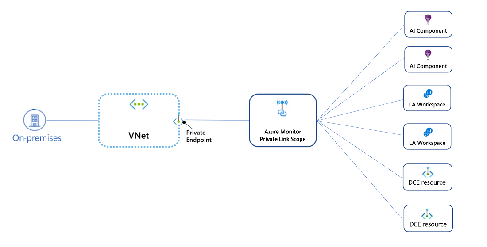
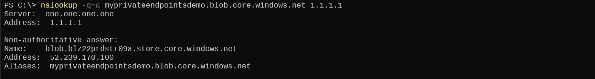
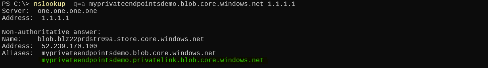

# Special Case -  Private Link Scopes

[home](./readme.md)

Some services, such as Azure Monitor, need different approach when implementing Private Endpoints because the services do not have unique per-resource or per-customer names. Because of this, the public DNS resolution for these service domain names need to work for both public and Private Endpoint customers. Further, due to the service design, a intermediary resource called an Private Link Scope (PLS) is needed between the Private Endpoint and the backend services.

## Connectivity

### Azure Monitor Private Link Scope Example

When you want to make your Azure Monitor resources--such as a Log Analytics Workspace--accessible only from your private network, you need to create an Azure Monitor Private Link Scope (AMPLS). Then, instead of associating a Private Endpoint to each Azure Monitor service, you associate the Private Endpoint to the AMPLS service, and proceed to lock down your Azure Monitor services by specifying on each that connections are only allowed through your AMPLS. Depending on the AMPLS settings, clients may continue be able to access public endpoint Azure Monitor services through your AMPLS for those you have not locked down.

The topology is shown below:

Client traffic to your Azure Monitor services will then flow from the client, to a Private Endpoint, to an AMPLS, and on to the requested service.

## DNS Resolution

Different from other Azure services, Azure Monitor always includes a *privatelink* CNAME in the DNS response from Microsoft's DNS--regardless of whether Private Endpoints have been configured.

### Azure Storage Account DNS Query Example

**Azure Storage Account blob service with no Private Endpoint configured**

**Azure Storage Account blob service with Private Endpoint configured** - note the `myprivateendpointsdemo.privatelink.blob.core.windows.net` CNAME in the response

### Azure Monitor DNS Query Example

**Azure Monitor Log Analytics service with no Private Endpoint configured** - note the `api.privatelink.monitor.azure.com` in the query response chain

### Impact on Private Endpoint DNS Design

For other services, creating and linking a *privatelink* Private DNS Zone to your resolver VNET before configuring Private Endpoints on your service is not an issue, as DNS queries resolve the service's public IP. However, because the *privatelink* CNAME is always in the query response for Azure Monitor services, doing this will break access to Azure Monitor services until Private Endpoints and AMPLS are configured. This is because DNS queries for Azure Monitor services will be attempted to be resolved by the empty *privatelink* DNS zone.

## More Information

- [Use Azure Private Link to connect networks to Azure Monitor](https://learn.microsoft.com/azure/azure-monitor/logs/private-link-security)
- [Private Link Scope impact on other traffic](https://learn.microsoft.com/azure/azure-monitor/logs/private-link-security#azure-monitor-private-links-rely-on-your-dns)
- [How Azure Monitor's Implementation of Private Link Differs from Other Services](https://techcommunity.microsoft.com/t5/fasttrack-for-azure/how-azure-monitor-s-implementation-of-private-link-differs-from/ba-p/3608938)

[home](./readme.md)
