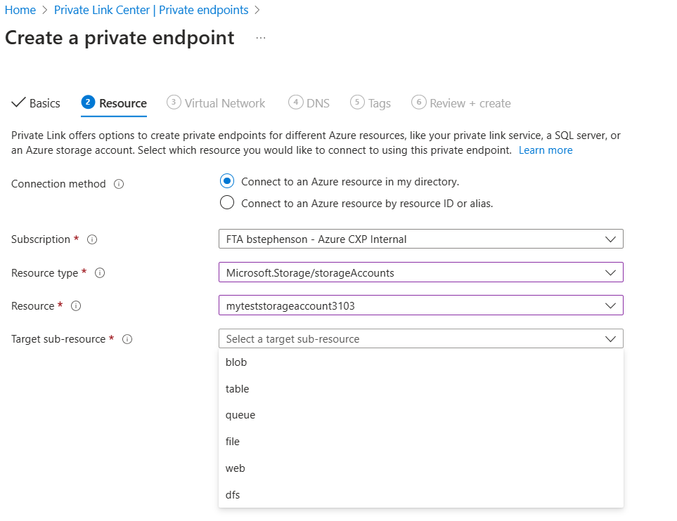

# Special Case - Storage Accounts

[home](./readme.md)

Storage accounts have a special consideration due to the fact that they do not have one single endpoint, but instead have an endpoint for each of their sub-resources.

When creating a Private Endpoint for a storage, you would be prompted to select which sub-resource that you wish to use.

Each one of these sub-resources will need their own DNS zone considerations, and their own private endpoints.

[home](./readme.md)
