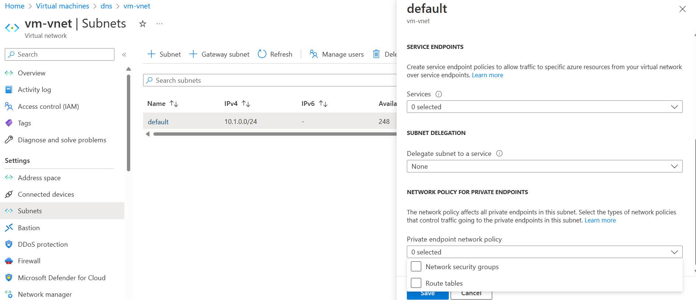
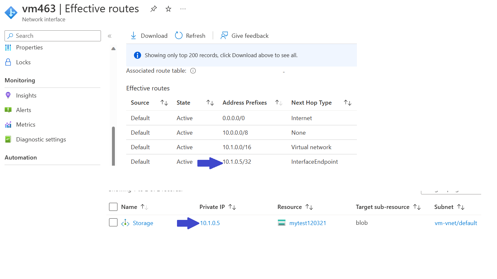
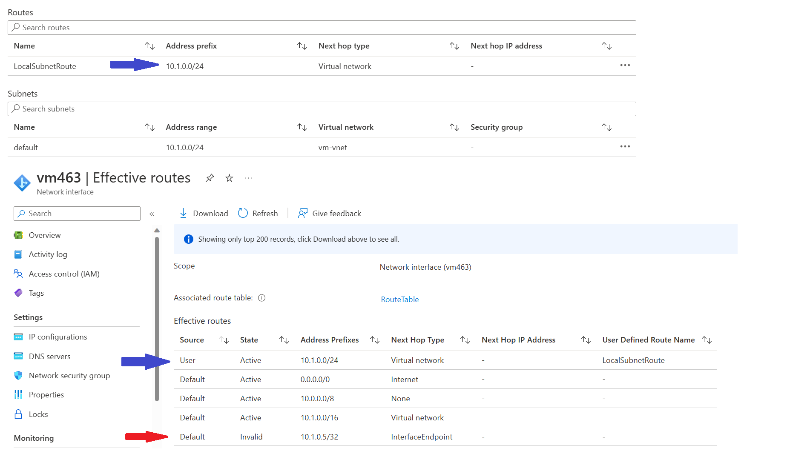

# Network Design for Private Endpoints

[prev](./troubleshooting.md) | [home](./readme.md)  | [next](./readme.md)

This section reviews some common field observations for designing your network to use private endpoints, from a security and routing perspective.

## Resource Firewall

Just having private endpoints doesn't prevent most resources from accepting traffic from their public endpoint.  To take advantage of the network isolation provided by private endpoints, you must also **deny public access on the resources service firewall**.

## Network Policies

In order to use NSGs and route tables to manage your private endpoints, you will need to enable network policies on the subnets that house the private endpoints.  Enabling network policies will affect all private endpoints in the subnet, and allow them to be managed with User-Define Routes and Network security groups.  A policy can enable one of these services, or both.

Read more about network policies [here](https://learn.microsoft.com/azure/private-link/disable-private-endpoint-network-policy?tabs=network-policy-portal).

## Securing Private Endpoints

In this section, we will be reviewing some common field observations to help you plan to secure your private endpoints from a network connectivity perspective.

The [Security Baseline for Azure Private Link](https://learn.microsoft.com/security/benchmark/azure/baselines/private-link-security-baseline?toc=%2Fazure%2Fprivate-link%2Ftoc.json) contains broader guidance for how to review logs, manage RBAC, and other security controls.

- Secure like VM NICs
- Follow core network isolation practices
- Use NSGs and ASGs to restrict access to resources on the same Spoke Vnet
- Use Firewalls and other appliances to secure between on-prem-to-spoke and spoke-to-spoke scenarios.

## Vnet and Subnet Design

Follow these guidelines to help plan for your Vnet and Subnet design:

- Place Private Endpoints in the same virtual network as the services that consume them, following spoke practices of having resources for a given workload in a single subscription or vnet.
- Use different resources between environments - do not try to reuse the same storage account between development and production environments, with the idea of using different private endpoints for isolation.
- Plan to deploy only one private endpoint for a given resource for main use; plan to have a second for failover if there is a network outage in your region.
  - Plan how you will address DNS as part of your failover.
- Isolate private endpoints in to their own subnets based on your subnet isolation strategy.  For example, place SQL and Storage Account Endpoints in different subnets, and if two different Storage Accounts would be accessed by different sources, place them in their own subnets.
- If a workload needs to access a private endpoint of another workload, leverage a Firewall or other security appliance to inspect the traffic.  You can review this guidance on [Inspecting Private Endpoints with Azure Firewall](https://learn.microsoft.com/azure/private-link/inspect-traffic-with-azure-firewall) for more information.

Many of these practices are the same as those used for virtual machines in Azure, so you should be able to apply many of the same patterns to Private Endpoints

## Securing Private Endpoint Subnets With NSGs

Once you have enabled Network Policies on your subnet, you can use a Network Security Group to secure access to the endpoint.  You can review [How network security groups filter network traffic](https://learn.microsoft.com/azure/virtual-network/network-security-group-how-it-works)

You should follow many of the same practices that you use to secure subnets housing VMs, such as:

- Limit inbound access to the subnet only to the resources that need access.
- Create a low priority "Deny All" rule to deny access even from within the virtual network.
- Place your Private Endpoints in to ASGs to apply consistent rules to the specific resources.  You can add this by going to the Application security groups tab on the Private Endpoint in the Azure portal, and selecting the ASG from the drop down there.
- Deny outbound access to the subnet of the Private Endpoint from other NSGs in the vnet for subnets that do not need access, to prevent unneeded access.

You can review some general network guidance for microsegmentation [here](https://learn.microsoft.com/security/zero-trust/deploy/networks#iv-network-segmentation-fully-distributed-ingressegress-cloud-micro-perimeters-and-deeper-micro-segmentation)

## Routing for Private Endpoints

By default, Private Endpoints will advertise their own *very specific* /32 route.  While this allows for easy routing behavior, it can create issues with inspecting traffic with NVAs.  This is propagated to the subnets in the same virtual network as the private endpoint, as well as any in any directly peered virtual networks.

If you enable the network policies as defined above, and then provide an overlapping route on route tables used by your subnets, the advertised private endpoint will be disabled even if it is more specific.

This vastly improves the ability to manage routing to Private Endpoints via NVAs.
