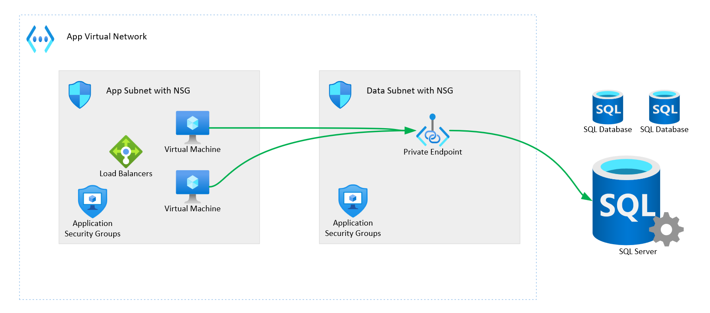

# Why use Private Endpoints?

Private Endpoints are a helpful tool to *provide private network/IP address for Azure services*.  They work with Azure Private Link to project the equivalent of a NIC resources for an Azure service not running in your virtual network, like a Storage Account or SQL Database.

Private Endpoints can be used for the following scenarios:

- Keeping workload traffic within your private network.
- Having an assigned public IP for accessing the service, instead of having to use the variable of a service endpoint.
- Access from your on-prem network to an Azure service via private networking (With a VPN or ExpressRoute Gateway)
- Standardizing management to NSGs and ASGs, instead of via service specific firewalls.

You should note that it isn't the only tool for securing network access to Azure services, but it is a tool that is excellent for specific security postures, and for executing practices like Zero Trust.
