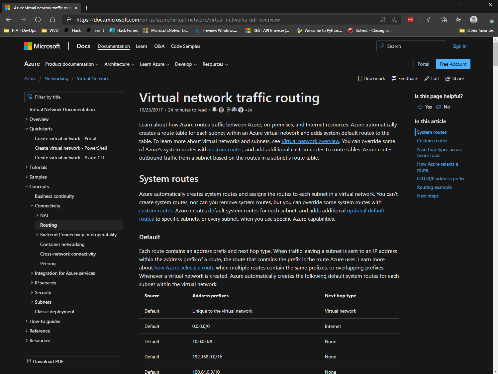

# Routing

#### [prev](./connectivity.md) | [home](./welcome.md)  | [next](./topology.md)

## Route types in Azure
* [System Routes](https://docs.microsoft.com/en-us/azure/virtual-network/virtual-networks-udr-overview)
* [Custom Routes](https://docs.microsoft.com/en-us/azure/virtual-network/virtual-networks-udr-overview)

Azure automatically creates system routes and assigns the routes to each subnet in a virtual network. 
Custom routes can be created either manaully i.e. [user-defined](https://docs.microsoft.com/en-us/azure/virtual-network/virtual-networks-udr-overview#user-defined) or by exchanging border gateway protocol (BGP) routes between your on-premises network gateway and an Azure virtual network gateway.

## BGP and Azure networking
An on-premises network gateway can exchange routes with an Azure virtual network gateway using the border gateway protocol (BGP). Using BGP with an Azure virtual network gateway is dependent on the type you selected when you created the gateway. If the type you selected were:

* ExpressRoute: You must use BGP to advertise on-premises routes to the Microsoft Edge router. You cannot create user-defined routes to force traffic to the ExpressRoute virtual network gateway if you deploy a virtual network gateway deployed as type: ExpressRoute. You can use user-defined routes for forcing traffic from the Express Route to, for example, a Network Virtual Appliance.
* VPN: You can, optionally use BGP. 

## Route Selection in Azure

If multiple routes contain the same address prefix, Azure selects the route type, based on the following priority:

1. User-defined route
2. BGP route
3. System route

## User defined routes and next hop types
You can create custom, or user-defined(static), routes in Azure to override Azure's default system routes, or to add additional routes to a subnet's route table. In Azure, you create a route table, then associate the route table to zero or more virtual network subnets.
Following next hop types are available when creating user-defined route:
* Virtual appliance
* Virtual Network Gateway
* None
* Virtual Network
* Internet

