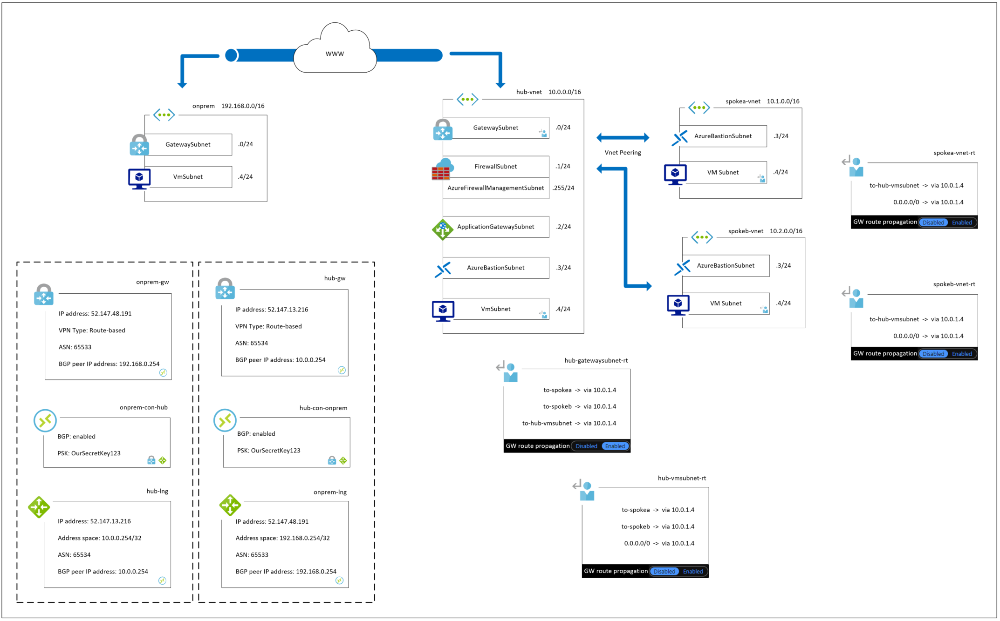

# Topology Overview

#### [prev](./basics.md) | [home](./welcome.md)  | [next](./connectivity.md)

## Hub and spoke 

A more [detailed](./topology.md) breakdown of the hub and spoke topology is covered after introducing connectivity and routing.

